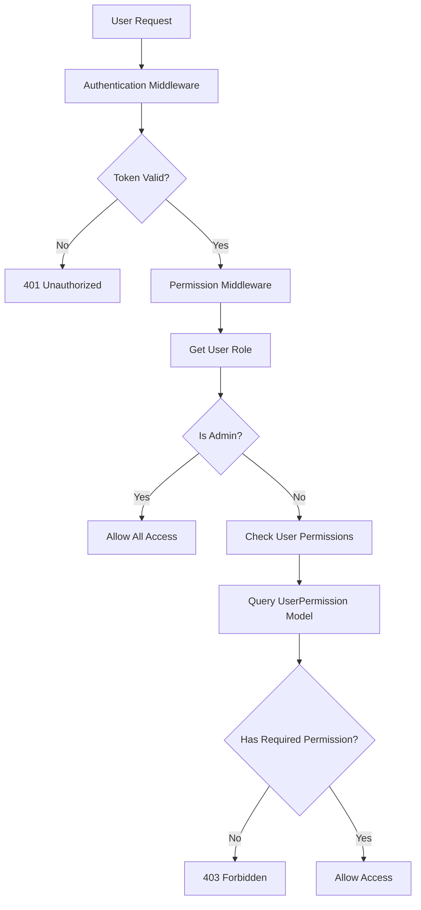

# Tài Liệu Hệ Thống Phân Quyền

Hệ thống phân quyền Role-Based Access Control (RBAC) cho nền tảng bất động sản, cung cấp kiểm soát truy cập chi tiết và linh hoạt.

## 📋 Mục Lục

- [Tổng Quan](#tổng-quan)
- [Kiến Trúc RBAC](#kiến-trúc-rbac)
- [Models & Database](#models--database)
- [Roles & Hierarchy](#roles--hierarchy)
- [Permission Groups](#permission-groups)
- [API Endpoints](#api-endpoints)
- [Implementation Guide](#implementation-guide)
- [Best Practices](#best-practices)
- [Troubleshooting](#troubleshooting)

## 🔍 Tổng Quan

### Khái Niệm Cốt Lõi

Hệ thống phân quyền được thiết kế dựa trên các nguyên tắc:

1. **Role-Based Access Control (RBAC)**: Người dùng được gán role, mỗi role có tập quyền cụ thể
2. **Granular Permissions**: Quyền được chia nhỏ theo từng hành động cụ thể
3. **Hierarchical Roles**: Admin > Employee > User với quyền kế thừa
4. **Dynamic Assignment**: Có thể thay đổi quyền mà không restart hệ thống

### Lợi Ích

- **Bảo mật cao**: Kiểm soát truy cập chi tiết từng tính năng
- **Linh hoạt**: Dễ dàng thêm/bớt quyền cho user
- **Scalable**: Hỗ trợ mở rộng hệ thống với nhiều role phức tạp
- **Audit Trail**: Theo dõi được ai có quyền gì, khi nào

### Flow Xác Thực & Phân Quyền



## 🏗 Kiến Trúc RBAC

### Component Overview

```
┌─────────────────┐    ┌─────────────────┐    ┌─────────────────┐
│     Users       │    │      Roles      │    │   Permissions   │
│                 │    │                 │    │                 │
│ - id            │    │ - admin         │    │ - create_user   │
│ - email         │    │ - employee      │    │ - edit_post     │
│ - role          │────┤ - user          │────┤ - view_stats    │
│ - status        │    │                 │    │ - manage_news   │
└─────────────────┘    └─────────────────┘    └─────────────────┘
         │                                              ▲
         └──────────────┐                              │
                        ▼                              │
                ┌─────────────────┐                    │
                │ UserPermissions │────────────────────┘
                │                 │
                │ - userId        │
                │ - permissions[] │
                │ - createdAt     │
                │ - updatedAt     │
                └─────────────────┘
```

### Database Relationships

- **Users**: 1-to-1 → **UserPermissions**
- **Users**: có field `role` định nghĩa vai trò cơ bản
- **UserPermissions**: chứa array permissions chi tiết cho user

## 📊 Models & Database

### User Model

```typescript
// models/User.ts
interface IUser extends Document {
  email: string;
  password: string;
  username?: string;
  role: 'admin' | 'employee' | 'user';  // Base role
  status: 'active' | 'inactive' | 'banned';
  // ... other fields
}
```

### UserPermission Model

```typescript
// models/UserPermission.ts
interface IUserPermission extends Document {
  userId: mongoose.Types.ObjectId;      // Reference to User
  permissions: string[];                // Array of permission strings
  createdAt: Date;
  updatedAt: Date;
}

const UserPermissionSchema: Schema = new Schema({
  userId: {
    type: mongoose.Schema.Types.ObjectId,
    ref: "User",
    required: true,
    unique: true,                       // Mỗi user chỉ có 1 record
  },
  permissions: {
    type: [String],                     // Array of permission strings
    default: [],
  },
}, { timestamps: true });
```

### Permission Storage

```javascript
// Example UserPermission document
{
  _id: ObjectId("..."),
  userId: ObjectId("648f1a2b3c4d5e6f7a8b9c0d"),
  permissions: [
    "view_users",
    "create_post", 
    "edit_post",
    "approve_post",
    "view_statistics",
    "manage_categories"
  ],
  createdAt: ISODate("2024-01-15T10:30:00Z"),
  updatedAt: ISODate("2024-01-20T15:45:00Z")
}
```

## 👥 Roles & Hierarchy

### Role Hierarchy

```
┌─────────────────────────────────────────────────────────┐
│                        ADMIN                           │
│  - Toàn quyền hệ thống                                  │
│  - Bypass mọi permission check                         │
│  - Quản lý users, employees, permissions               │
└─────────────────────────────────────────────────────────┘
                          │
                          ▼
┌─────────────────────────────────────────────────────────┐
│                      EMPLOYEE                          │
│  - Quyền mặc định + quyền được gán thêm                 │
│  - Không thể có quyền admin-level                      │
│  - Được admin quản lý permissions                      │
└─────────────────────────────────────────────────────────┘
                          │
                          ▼
┌─────────────────────────────────────────────────────────┐
│                        USER                            │
│  - Quyền cơ bản: quản lý profile, đăng tin              │
│  - Không có quyền admin                                │
│  - Tự quản lý content của mình                         │
└─────────────────────────────────────────────────────────┘
```

### Role Characteristics

#### Admin Role
- **Đặc quyền**: Bypass tất cả permission checks
- **Không cần**: UserPermission record (tự động có mọi quyền)
- **Trách nhiệm**: 
  - Quản lý toàn bộ hệ thống
  - Gán quyền cho employees
  - Kiểm soát tất cả content và users

```typescript
// Trong middleware
if (req.user?.role === "admin") {
  return next(); // Admin bypass mọi check
}
```

#### Employee Role  
- **Quyền mặc định**: Tập quyền cơ bản cho công việc hàng ngày
- **Quyền mở rộng**: Admin có thể gán thêm quyền cụ thể
- **Giới hạn**: Không thể có quyền admin-level như delete users

```typescript
// Default employee permissions
const defaultEmployeePermissions = [
  "view_users",      // Xem danh sách users
  "view_posts",      // Xem tin đăng
  "create_post",     // Tạo tin đăng mới
  "edit_post",       // Sửa tin đăng
  "view_projects",   // Xem dự án
  "view_news",       // Xem tin tức
  "create_news",     // Tạo tin tức
  "edit_news",       // Sửa tin tức
  "view_dashboard",  // Truy cập dashboard
  "view_settings",   // Xem cài đặt
  "view_locations",  // Xem địa điểm
];

// Manageable permissions (admin có thể gán thêm)
const manageableEmployeePermissions = [
  "create_user",     // Tạo user mới
  "edit_user",       // Sửa thông tin user
  "delete_user",     // Xóa user
  "change_user_status", // Thay đổi trạng thái user
  "approve_post",    // Duyệt tin đăng
  "reject_post",     // Từ chối tin đăng
  "feature_post",    // Đặt tin nổi bật
  "delete_post",     // Xóa tin đăng
  // ... more permissions
];
```

#### User Role
- **Quyền cơ bản**: Quản lý profile, đăng tin cá nhân
- **Tự quản lý**: Chỉ được thao tác với content của mình
- **Không có**: Quyền admin hay employee

```typescript
// Typical user permissions (implicit)
const userPermissions = [
  "view_own_profile",
  "edit_own_profile", 
  "create_own_post",
  "edit_own_post",
  "delete_own_post",
  "view_public_content"
];
```

## 🔐 Permission Groups

### Nhóm Quyền Hệ Thống

#### 1. User Management (`users`)
```javascript
const userPermissions = [
  "view_users",           // Xem danh sách người dùng
  "create_user",          // Tạo tài khoản mới
  "edit_user",            // Sửa thông tin người dùng
  "delete_user",          // Xóa tài khoản
  "change_user_role",     // Thay đổi vai trò
  "change_user_status",   // Thay đổi trạng thái (active/banned)
  "reset_user_password",  // Reset mật khẩu
  "approve_user",         // Duyệt tài khoản
];
```

#### 2. Post Management (`posts`)
```javascript
const postPermissions = [
  "view_posts",           // Xem danh sách tin đăng
  "create_post",          // Tạo tin đăng mới
  "edit_post",            // Sửa tin đăng
  "delete_post",          // Xóa tin đăng
  "approve_post",         // Duyệt tin đăng
  "reject_post",          // Từ chối tin đăng
  "feature_post",         // Đặt tin nổi bật
  "view_deleted_posts",   // Xem tin đã xóa
  "restore_post",         // Khôi phục tin đã xóa
];
```

#### 3. Project Management (`projects`)
```javascript
const projectPermissions = [
  "view_projects",        // Xem danh sách dự án
  "create_project",       // Tạo dự án mới
  "edit_project",         // Sửa thông tin dự án
  "delete_project",       // Xóa dự án
  "feature_project",      // Đặt dự án nổi bật
];
```

#### 4. News Management (`news`)
```javascript
const newsPermissions = [
  "view_news",                // Xem tin tức
  "create_news",              // Tạo tin tức mới
  "edit_news",                // Sửa tin tức
  "delete_news",              // Xóa tin tức
  "feature_news",             // Đặt tin nổi bật
  "publish_news",             // Xuất bản tin
  "manage_news_categories",   // Quản lý danh mục tin
];
```

#### 5. Financial (`transactions`)
```javascript
const transactionPermissions = [
  "view_transactions",        // Xem giao dịch
  "view_financial_stats",     // Xem thống kê tài chính
  "export_transactions",      // Xuất báo cáo giao dịch
  "process_refunds",          // Xử lý hoàn tiền
];
```

#### 6. Analytics & Reports (`statistics`)
```javascript
const statisticsPermissions = [
  "view_statistics",      // Xem thống kê
  "view_dashboard",       // Truy cập dashboard
  "export_statistics",    // Xuất thống kê
  "generate_reports",     // Tạo báo cáo
  "view_financial_stats", // Xem thống kê tài chính
];
```

#### 7. System Settings (`settings`)
```javascript
const settingsPermissions = [
  "view_settings",        // Xem cài đặt
  "edit_settings",        // Sửa cài đặt hệ thống
  "manage_sidebar",       // Quản lý sidebar
  "manage_header",        // Quản lý header
  "manage_categories",    // Quản lý danh mục
];
```

#### 8. Location Management (`locations`)
```javascript
const locationPermissions = [
  "view_locations",       // Xem địa điểm
  "manage_locations",     // Quản lý địa điểm
  "manage_areas",         // Quản lý khu vực
  "manage_prices",        // Quản lý giá theo vùng
];
```

### Permission Naming Convention

```
[action]_[resource]_[scope?]

Examples:
- view_users          (action: view, resource: users)
- edit_own_post      (action: edit, resource: post, scope: own)
- manage_categories  (action: manage, resource: categories)
- export_statistics  (action: export, resource: statistics)
```

**Actions**: `view`, `create`, `edit`, `delete`, `approve`, `reject`, `manage`, `export`
**Resources**: `users`, `posts`, `projects`, `news`, `transactions`, `settings`
**Scopes**: `own`, `all`, `public` (optional)

## 🔗 API Endpoints

### Permission Management APIs

#### 1. Get User Permissions
```http
GET /api/permissions/user/:userId
```

**Authorization**: Admin hoặc chính user đó
**Response**:
```json
{
  "success": true,
  "data": {
    "userId": "648f1a2b3c4d5e6f7a8b9c0d",
    "username": "john_doe",
    "permissions": [
      "view_users",
      "create_post",
      "edit_post",
      "approve_post"
    ]
  },
  "message": "Lấy danh sách quyền thành công"
}
```

#### 2. Update User Permissions
```http
PUT /api/permissions/user/:userId
```

**Authorization**: Admin only
**Body**:
```json
{
  "permissions": [
    "view_users",
    "create_post", 
    "edit_post",
    "approve_post",
    "view_statistics"
  ]
}
```

**Response**:
```json
{
  "success": true,
  "data": {
    "userId": "648f1a2b3c4d5e6f7a8b9c0d",
    "username": "john_doe",
    "permissions": [
      "view_users",
      "create_post",
      "edit_post", 
      "approve_post",
      "view_statistics"
    ]
  },
  "message": "Cập nhật quyền thành công"
}
```

#### 3. Create User Permissions
```http
POST /api/permissions/user
```

**Authorization**: Admin only
**Body**:
```json
{
  "userId": "648f1a2b3c4d5e6f7a8b9c0d",
  "permissions": [
    "view_users",
    "create_post",
    "edit_post"
  ]
}
```

#### 4. Delete User Permissions
```http
DELETE /api/permissions/user/:userId
```

**Authorization**: Admin only

#### 5. Get Available Permissions
```http
GET /api/permissions/available
```

**Authorization**: Admin or Employee
**Response**:
```json
{
  "success": true,
  "data": {
    "permissionGroups": {
      "users": [
        "view_users",
        "create_user",
        "edit_user",
        "delete_user"
      ],
      "posts": [
        "view_posts", 
        "edit_post",
        "delete_post",
        "approve_post"
      ]
    },
    "manageableEmployeePermissions": [
      "create_user",
      "edit_user",
      "approve_post"
    ]
  },
  "message": "Lấy danh sách quyền thành công"
}
```

#### 6. Get Users And Permissions
```http
GET /api/permissions/users-and-permissions
```

**Authorization**: Admin only
**Response**:
```json
{
  "success": true,
  "data": {
    "users": [
      {
        "_id": "648f1a2b3c4d5e6f7a8b9c0d",
        "username": "employee1",
        "email": "employee1@example.com",
        "role": "employee",
        "status": "active",
        "permissions": [
          "view_users",
          "create_post",
          "edit_post",
          "approve_post"
        ],
        "createdAt": "2024-01-15T10:30:00Z"
      }
    ]
  },
  "message": "Lấy danh sách người dùng và quyền thành công"
}
```

#### 7. Update Employee Permissions
```http
PUT /api/permissions/employee
```

**Authorization**: Admin only
**Body**:
```json
{
  "userId": "648f1a2b3c4d5e6f7a8b9c0d",
  "permissions": [
    "create_user",
    "edit_user", 
    "approve_post",
    "view_statistics"
  ]
}
```

**Logic**: 
- Chỉ cho phép gán các `manageableEmployeePermissions`
- Tự động thêm `defaultEmployeePermissions`
- Final permissions = default + manageable

#### 8. Get Employees And Permissions
```http
GET /api/permissions/employees
```

**Authorization**: Admin only
**Response** chứa thông tin employee với permissions được phân tách:
- `permissions`: Tất cả quyền hiện tại
- `defaultPermissions`: Quyền mặc định không đổi
- `enabledPermissions`: Quyền được bật thêm
- `manageablePermissions`: Quyền có thể quản lý

## 🔨 Implementation Guide

### 1. Setup Permission System

#### Create UserPermission for New Employee
```typescript
// Khi tạo employee mới
const createEmployee = async (userData) => {
  // 1. Tạo user
  const user = await User.create({
    ...userData,
    role: 'employee'
  });

  // 2. Tạo permissions mặc định
  const defaultPermissions = [
    "view_users",
    "view_posts", 
    "create_post",
    "edit_post",
    "view_dashboard",
    "view_settings"
  ];

  await UserPermission.create({
    userId: user._id,
    permissions: defaultPermissions
  });

  return user;
};
```

#### Check Permissions in Controllers
```typescript
// controllers/PostController.ts
export class PostController {
  static async approvePost(req: AuthenticatedRequest, res: Response) {
    // Permission đã được check trong middleware
    // requirePermission('approve_post')
    
    const { postId } = req.params;
    
    const post = await Post.findByIdAndUpdate(
      postId,
      { 
        status: 'approved',
        approvedBy: req.user?.userId,
        approvedAt: new Date()
      },
      { new: true }
    );
    
    return res.json({
      success: true,
      data: post,
      message: 'Duyệt tin đăng thành công'
    });
  }
}
```

#### Route Protection
```typescript
// routes/postRoutes.ts
import { requireAuth, requirePermission } from '../middleware/auth';

// Ai cũng xem được
router.get('/posts', PostController.list);

// Cần đăng nhập
router.post('/posts', requireAuth, PostController.create);

// Cần quyền cụ thể
router.put('/posts/:id/approve', 
  requireAuth,
  requirePermission('approve_post'),
  PostController.approve
);

// Cần nhiều quyền
router.delete('/posts/:id',
  requireAuth,
  requireAllPermissions(['delete_post', 'manage_content']),
  PostController.delete
);

// Cần một trong các quyền
router.put('/posts/:id',
  requireAuth,
  requireAnyPermission(['edit_own_post', 'edit_all_posts']),
  PostController.update  
);
```

### 2. Frontend Permission Checks

#### Permission Hook
```typescript
// hooks/usePermissions.ts
export const usePermissions = () => {
  const { user } = useAuth();
  
  const hasPermission = useCallback((permission: string): boolean => {
    if (!user) return false;
    if (user.role === 'admin') return true;
    
    return user.permissions?.includes(permission) || false;
  }, [user]);
  
  const hasAnyPermission = useCallback((permissions: string[]): boolean => {
    return permissions.some(permission => hasPermission(permission));
  }, [hasPermission]);
  
  const hasAllPermissions = useCallback((permissions: string[]): boolean => {
    return permissions.every(permission => hasPermission(permission));
  }, [hasPermission]);
  
  return {
    hasPermission,
    hasAnyPermission, 
    hasAllPermissions,
    isAdmin: user?.role === 'admin',
    isEmployee: user?.role === 'employee'
  };
};
```

#### Permission Guard Component
```typescript
// components/PermissionGuard.tsx
interface PermissionGuardProps {
  permission?: string;
  permissions?: string[];
  requireAll?: boolean;
  fallback?: React.ReactNode;
  children: React.ReactNode;
}

export const PermissionGuard: React.FC<PermissionGuardProps> = ({
  permission,
  permissions = [],
  requireAll = true,
  fallback = null,
  children
}) => {
  const { hasPermission, hasAllPermissions, hasAnyPermission } = usePermissions();
  
  let hasAccess = false;
  
  if (permission) {
    hasAccess = hasPermission(permission);
  } else if (permissions.length > 0) {
    hasAccess = requireAll 
      ? hasAllPermissions(permissions)
      : hasAnyPermission(permissions);
  }
  
  return hasAccess ? <>{children}</> : <>{fallback}</>;
};

// Usage
<PermissionGuard permission="approve_post">
  <Button onClick={approvePost}>Duyệt tin</Button>
</PermissionGuard>

<PermissionGuard 
  permissions={['edit_post', 'delete_post']} 
  requireAll={false}
>
  <PostActions />
</PermissionGuard>
```

### 3. Dynamic Menu Rendering

```typescript
// components/AdminSidebar.tsx
const menuItems = [
  {
    label: 'Quản lý người dùng',
    path: '/admin/users',
    permission: 'view_users'
  },
  {
    label: 'Duyệt tin đăng', 
    path: '/admin/posts',
    permission: 'approve_post'
  },
  {
    label: 'Thống kê',
    path: '/admin/statistics',
    permission: 'view_statistics'
  }
];

export const AdminSidebar = () => {
  const { hasPermission } = usePermissions();
  
  const visibleMenuItems = menuItems.filter(item => 
    hasPermission(item.permission)
  );
  
  return (
    <nav>
      {visibleMenuItems.map(item => (
        <Link key={item.path} href={item.path}>
          {item.label}
        </Link>
      ))}
    </nav>
  );
};
```

## 💡 Best Practices

### 1. Permission Design

#### Granular Permissions
```typescript
// ĐÚNG: Quyền chi tiết, dễ kiểm soát
const permissions = [
  'create_post',
  'edit_own_post', 
  'edit_all_posts',
  'delete_own_post',
  'delete_all_posts',
  'approve_post',
  'feature_post'
];

// TRÁNH: Quyền quá chung chung
const permissions = [
  'manage_posts'  // Quá rộng, khó kiểm soát chi tiết
];
```

#### Logical Permission Groups
```typescript
// Group theo tính năng nghiệp vụ
const contentManagement = [
  'create_post', 'edit_post', 'delete_post',
  'approve_post', 'reject_post', 'feature_post'
];

const userManagement = [
  'view_users', 'create_user', 'edit_user', 
  'delete_user', 'change_user_status'
];

const analytics = [
  'view_statistics', 'export_statistics',
  'generate_reports', 'view_dashboard'
];
```

### 2. Security Best Practices

#### Always Check on Backend
```typescript
// ĐÚNG: Kiểm tra quyền ở backend
router.put('/posts/:id/approve',
  requireAuth,
  requirePermission('approve_post'),  // Backend check
  PostController.approve
);

// Frontend chỉ để UX, không phải security
<PermissionGuard permission="approve_post">
  <ApproveButton />  {/* UI check only */}
</PermissionGuard>
```

#### Principle of Least Privilege
```typescript
// Chỉ gán quyền tối thiểu cần thiết
const newEmployeePermissions = [
  'view_dashboard',
  'view_posts', 
  'create_post',
  'edit_own_post'  // Chỉ sửa post của mình
];

// Không gán hết quyền từ đầu
// Admin sẽ bật thêm quyền khi cần
```

#### Audit Permission Changes
```typescript
// Log mọi thay đổi permission
const updateUserPermissions = async (userId, newPermissions, adminId) => {
  const oldPermissions = await getUserPermissions(userId);
  
  await UserPermission.findOneAndUpdate(
    { userId },
    { permissions: newPermissions }
  );
  
  // Audit log
  await AuditLog.create({
    action: 'UPDATE_PERMISSIONS',
    targetUserId: userId,
    performedBy: adminId,
    changes: {
      from: oldPermissions,
      to: newPermissions,
      added: newPermissions.filter(p => !oldPermissions.includes(p)),
      removed: oldPermissions.filter(p => !newPermissions.includes(p))
    },
    timestamp: new Date()
  });
};
```

### 3. Performance Optimization

#### Cache Permissions
```typescript
// Cache user permissions để tránh query liên tục
const permissionCache = new NodeCache({ stdTTL: 300 }); // 5 minutes

const getUserPermissions = async (userId: string) => {
  const cacheKey = `permissions:${userId}`;
  let permissions = permissionCache.get(cacheKey);
  
  if (!permissions) {
    const userPermission = await UserPermission.findOne({ userId });
    permissions = userPermission?.permissions || [];
    permissionCache.set(cacheKey, permissions);
  }
  
  return permissions;
};

// Xóa cache khi update permissions
const updateUserPermissions = async (userId: string, newPermissions: string[]) => {
  await UserPermission.findOneAndUpdate(
    { userId },
    { permissions: newPermissions }
  );
  
  // Clear cache
  permissionCache.del(`permissions:${userId}`);
};
```

#### Batch Permission Checks
```typescript
// Tải permissions cho nhiều users cùng lúc
const getUsersWithPermissions = async (userIds: string[]) => {
  const users = await User.find({ _id: { $in: userIds } });
  const permissions = await UserPermission.find({ 
    userId: { $in: userIds } 
  });
  
  return users.map(user => ({
    ...user.toObject(),
    permissions: permissions.find(p => 
      p.userId.toString() === user._id.toString()
    )?.permissions || []
  }));
};
```

### 4. Error Handling

#### Consistent Error Messages
```typescript
const PermissionErrors = {
  INSUFFICIENT_PERMISSIONS: {
    code: 'INSUFFICIENT_PERMISSIONS',
    message: 'Bạn không có quyền thực hiện hành động này',
    status: 403
  },
  PERMISSION_NOT_FOUND: {
    code: 'PERMISSION_NOT_FOUND', 
    message: 'Không tìm thấy quyền của người dùng',
    status: 404
  },
  INVALID_PERMISSION: {
    code: 'INVALID_PERMISSION',
    message: 'Quyền không hợp lệ',
    status: 400
  }
};

// Usage
if (!hasPermission(requiredPermission)) {
  throw new PermissionError(PermissionErrors.INSUFFICIENT_PERMISSIONS);
}
```

### 5. Testing Permissions

#### Unit Tests
```typescript
// __tests__/permissions.test.ts
describe('Permission System', () => {
  describe('Admin Role', () => {
    it('should bypass all permission checks', async () => {
      const adminUser = { role: 'admin', userId: 'admin123' };
      const middleware = requirePermission('any_permission');
      
      const req = { user: adminUser };
      const next = jest.fn();
      
      await middleware(req, res, next);
      
      expect(next).toHaveBeenCalled();
      expect(res.status).not.toHaveBeenCalled();
    });
  });
  
  describe('Employee Permissions', () => {
    it('should allow access with correct permission', async () => {
      const employee = { 
        role: 'employee', 
        userId: 'emp123' 
      };
      
      // Mock UserPermission.findOne
      UserPermission.findOne.mockResolvedValue({
        permissions: ['approve_post']
      });
      
      const middleware = requirePermission('approve_post');
      const req = { user: employee };
      const next = jest.fn();
      
      await middleware(req, res, next);
      
      expect(next).toHaveBeenCalled();
    });
    
    it('should deny access without permission', async () => {
      const employee = { 
        role: 'employee', 
        userId: 'emp123' 
      };
      
      UserPermission.findOne.mockResolvedValue({
        permissions: ['view_posts']  // Không có approve_post
      });
      
      const middleware = requirePermission('approve_post');
      const req = { user: employee };
      const next = jest.fn();
      
      await middleware(req, res, next);
      
      expect(next).not.toHaveBeenCalled();
      expect(res.status).toHaveBeenCalledWith(403);
    });
  });
});
```

## 🐛 Troubleshooting

### Common Issues

#### 1. Permission Not Working
**Symptoms**: User có quyền nhưng vẫn bị từ chối
**Possible Causes**:
- Cache permission cũ
- UserPermission record không tồn tại
- Middleware order sai
- Permission string không match

**Solutions**:
```typescript
// 1. Check UserPermission record
const checkUserPermissions = async (userId) => {
  const userPerm = await UserPermission.findOne({ userId });
  console.log('User permissions:', userPerm?.permissions);
};

// 2. Clear permission cache
permissionCache.del(`permissions:${userId}`);

// 3. Verify middleware order
app.use('/api/admin/*', 
  requireAuth,           // 1. Auth first
  requirePermission(...), // 2. Then permission
  controller            // 3. Finally controller
);

// 4. Debug permission check
const debugPermission = (requiredPerm, userPerms) => {
  console.log('Required:', requiredPerm);
  console.log('User has:', userPerms);
  console.log('Match:', userPerms.includes(requiredPerm));
};
```

#### 2. Admin Bypass Not Working
**Symptoms**: Admin bị từ chối quyền
**Check**: 
```typescript
// Verify role field
const user = await User.findById(userId);
console.log('User role:', user.role);
console.log('Is admin:', user.role === 'admin');

// Check middleware logic
if (req.user?.role === "admin") {
  console.log('Admin bypass activated');
  return next();
}
```

#### 3. Employee Default Permissions
**Symptoms**: Employee không có quyền mặc định
**Solution**: 
```typescript
// Ensure default permissions được set khi tạo employee
const createEmployeeWithPermissions = async (userData) => {
  const user = await User.create({ ...userData, role: 'employee' });
  
  const defaultPermissions = [
    "view_dashboard",
    "view_posts", 
    "create_post"
  ];
  
  await UserPermission.create({
    userId: user._id,
    permissions: defaultPermissions
  });
};
```

### Debug Tools

#### Permission Debug Middleware
```typescript
export const debugPermissions = async (req: AuthenticatedRequest, res: Response, next: NextFunction) => {
  if (process.env.NODE_ENV === 'development') {
    console.log('🔍 Permission Debug:', {
      user: req.user?.email,
      role: req.user?.role,
      userId: req.user?.userId,
      path: req.path,
      method: req.method
    });
    
    if (req.user && req.user.role !== 'admin') {
      const userPermission = await UserPermission.findOne({
        userId: req.user.userId
      });
      console.log('   - User permissions:', userPermission?.permissions);
    }
  }
  next();
};

// Use in development
if (process.env.NODE_ENV === 'development') {
  app.use('/api/*', debugPermissions);
}
```

#### Permission Checker Utility
```typescript
// utils/permissionChecker.ts
export const checkUserPermission = async (userId: string, permission: string) => {
  const user = await User.findById(userId);
  if (!user) {
    return { hasPermission: false, reason: 'User not found' };
  }
  
  if (user.role === 'admin') {
    return { hasPermission: true, reason: 'Admin bypass' };
  }
  
  const userPermission = await UserPermission.findOne({ userId });
  if (!userPermission) {
    return { hasPermission: false, reason: 'No permissions record' };
  }
  
  const hasPermission = userPermission.permissions.includes(permission);
  return {
    hasPermission,
    reason: hasPermission ? 'Permission granted' : 'Permission denied',
    userPermissions: userPermission.permissions
  };
};

// Usage for debugging
const result = await checkUserPermission('userId123', 'approve_post');
console.log('Permission check result:', result);
```

---

## 📞 Hỗ Trợ

Nếu gặp vấn đề với hệ thống phân quyền:

1. **Check logs**: Middleware có logging chi tiết
2. **Verify database**: Kiểm tra UserPermission collection
3. **Test permissions**: Sử dụng debug utilities
4. **Cache issues**: Clear permission cache
5. **Frontend vs Backend**: Đảm bảo cả 2 đều được check

**Development tip**: Bật debug mode để theo dõi permission flow chi tiết.