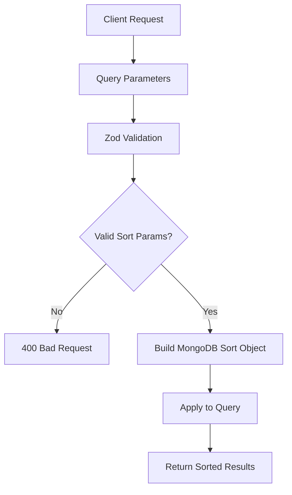

# Tài Liệu Hệ Thống Sắp Xếp (SortBy)

Hệ thống sắp xếp linh hoạt cho các API endpoints của nền tảng bất động sản, hỗ trợ sắp xếp theo nhiều trường và thứ tự khác nhau.

## 📋 Mục Lục

- [Tổng Quan](#tổng-quan)
- [Cách Hoạt Động](#cách-hoạt-động)
- [Schema Validation](#schema-validation)
- [Supported Fields](#supported-fields)
- [API Implementation](#api-implementation)
- [Frontend Integration](#frontend-integration)
- [Best Practices](#best-practices)
- [Troubleshooting](#troubleshooting)

## 🔍 Tổng Quan

### Khái Niệm Cốt Lõi

Hệ thống SortBy cung cấp khả năng sắp xếp dữ liệu một cách linh hoạt và thống nhất trên toàn bộ API:

- **Flexible Sorting**: Sắp xếp theo bất kỳ field nào được hỗ trợ
- **Bidirectional**: Hỗ trợ cả ascending (tăng dần) và descending (giảm dần)
- **Type Safe**: Validation với Zod đảm bảo type safety
- **Performance Optimized**: Sử dụng MongoDB indexes cho hiệu suất tối ưu

### Flow Hoạt Động



### Lợi Ích

- **Consistent API**: Tất cả endpoints đều sử dụng cùng pattern
- **User-Friendly**: Frontend dễ dàng implement sorting UI
- **Performance**: Tận dụng database indexes
- **Validation**: Ngăn chặn injection attacks qua sort parameters

## ⚙️ Cách Hoạt Động

### Query Parameters Structure

Mọi API sorting đều sử dụng 2 parameters chuẩn:

```
GET /api/posts?sortBy=price&sortOrder=desc
GET /api/projects?sortBy=createdAt&sortOrder=asc
GET /api/users?sortBy=name&sortOrder=asc
```

**Parameters**:

- `sortBy`: Tên field để sắp xếp theo
- `sortOrder`: Thứ tự sắp xếp (`asc` hoặc `desc`)

### MongoDB Implementation

```typescript
// Backend implementation pattern
const buildSortObject = (sortBy: string, sortOrder: string) => {
  const sort: any = {};
  sort[sortBy] = sortOrder === "desc" ? -1 : 1;
  return sort;
};

// Usage in query
const posts = await Post.find(filter)
  .sort(buildSortObject(sortBy, sortOrder))
  .limit(limit)
  .skip(skip);
```

### Default Behavior

Khi không có sort parameters:

- **sortBy**: Mặc định là `createdAt` (sắp xếp theo thời gian tạo)
- **sortOrder**: Mặc định là `desc` (mới nhất trước)

```typescript
// Default values
const { sortBy = "createdAt", sortOrder = "desc" } = req.query;
```

## ✅ Schema Validation

### Common Sort Schema

```typescript
// validations/common.ts
export const sortSchema = z.object({
  sortBy: z.string().optional().default("createdAt"),
  sortOrder: z.enum(["asc", "desc"]).optional().default("desc"),
});
```

### Specific Entity Schemas

#### Post Search Schema

```typescript
// validations/postValidation.ts
export const postSearchSchema = z.object({
  // ... other fields
  sortBy: z
    .enum(["createdAt", "updatedAt", "price", "area", "views"])
    .default("createdAt"),
  sortOrder: z.enum(["asc", "desc"]).default("desc"),
});
```

**Supported sortBy fields for Posts**:

- `createdAt` - Thời gian tạo tin đăng
- `updatedAt` - Thời gian cập nhật cuối
- `price` - Giá bán/cho thuê
- `area` - Diện tích
- `views` - Số lượt xem
- `priority` - Sắp xếp theo gói ưu tiên (VIP > Premium > Normal)

#### Priority-Based Sorting

Hệ thống Real Estate sử dụng **priority sorting** để hiển thị bài đăng theo gói dịch vụ:

```typescript
// Priority levels hierarchy
enum PostPriority {
  VIP = "vip", // Ưu tiên cao nhất
  PREMIUM = "premium", // Ưu tiên trung bình
  NORMAL = "normal", // Ưu tiên thấp nhất
}

// Implementation logic:
// 1. Query VIP posts first → sort by sortBy parameter
// 2. Query Premium posts → sort by sortBy parameter
// 3. Query Normal posts → sort by sortBy parameter
// 4. Combine results: [VIP posts] + [Premium posts] + [Normal posts]
```

**Priority Sort Behavior**:

- Luôn ưu tiên gói VIP trước, bất kể giá trị field khác
- Trong cùng priority level, sắp xếp theo `sortBy` parameter
- Đảm bảo trải nghiệm người dùng và logic kinh doanh

**Usage Examples**:

```http
# VIP posts xuất hiện trước, sau đó sắp xếp theo giá giảm dần
GET /api/posts?sortBy=price&sortOrder=desc

# VIP posts trước, Premium posts, Normal posts - mỗi nhóm sắp xếp theo diện tích tăng dần
GET /api/posts?sortBy=area&sortOrder=asc
```

#### Project Search Schema

```typescript
// Trong ProjectController
const sortBy = (req.query.sortBy as string) || "newest";

// Supported sortBy values for Projects:
switch (sortBy) {
  case "newest":
    sortObject = { createdAt: -1 };
    break;
  case "oldest":
    sortObject = { createdAt: 1 };
    break;
  case "name_asc":
    sortObject = { name: 1 };
    break;
  case "name_desc":
    sortObject = { name: -1 };
    break;
  case "price_low":
    sortObject = { "pricing.minPrice": 1 };
    break;
  case "price_high":
    sortObject = { "pricing.maxPrice": -1 };
    break;
  default:
    sortObject = { createdAt: -1 };
}
```

#### User/Admin Listings Schema

```typescript
// Customer Contact schema example
const { sortBy = "createdAt", sortOrder = "desc" } = req.query;

// Validation
const validSortFields = ["createdAt", "updatedAt", "name", "email", "status"];
if (!validSortFields.includes(sortBy)) {
  throw new Error("Invalid sort field");
}
```

### Validation Examples

```typescript
// Valid requests
GET /api/posts?sortBy=price&sortOrder=asc       ✅
GET /api/posts?sortBy=createdAt&sortOrder=desc  ✅
GET /api/posts?sortBy=views                     ✅ (defaults to desc)

// Invalid requests
GET /api/posts?sortBy=invalidField&sortOrder=asc  ❌ 400 Bad Request
GET /api/posts?sortBy=price&sortOrder=invalid     ❌ 400 Bad Request
```

## 🗂 Supported Fields

### Posts/Properties

| Field       | Description        | Type   | Example Values             | Priority Behavior      |
| ----------- | ------------------ | ------ | -------------------------- | ---------------------- |
| `createdAt` | Thời gian tạo tin  | Date   | `2024-01-15T10:30:00Z`     | VIP → Premium → Normal |
| `updatedAt` | Thời gian cập nhật | Date   | `2024-01-20T15:45:00Z`     | VIP → Premium → Normal |
| `price`     | Giá (VND)          | Number | `5000000000`               | VIP → Premium → Normal |
| `area`      | Diện tích (m²)     | Number | `120.5`                    | VIP → Premium → Normal |
| `views`     | Số lượt xem        | Number | `1250`                     | VIP → Premium → Normal |
| `priority`  | Sắp xếp theo gói   | Enum   | `vip`, `premium`, `normal` | Luôn ưu tiên VIP trước |

#### Priority Logic Explanation

**Business Logic**: Tin đăng VIP luôn xuất hiện trước, bất kể giá trị của field khác

```typescript
// Ví dụ thực tế với sortBy=price&sortOrder=desc:
// 1. VIP posts với giá cao nhất trước
// 2. Sau đó Premium posts với giá cao nhất
// 3. Cuối cùng Normal posts với giá cao nhất

const searchResults = [
  ...vipPosts.sort((a, b) => b.price - a.price), // VIP: 10 tỷ, 8 tỷ, 5 tỷ
  ...premiumPosts.sort((a, b) => b.price - a.price), // Premium: 12 tỷ, 7 tỷ, 3 tỷ
  ...normalPosts.sort((a, b) => b.price - a.price), // Normal: 15 tỷ, 6 tỷ, 2 tỷ
];

// Kết quả: VIP(10tỷ) → VIP(8tỷ) → VIP(5tỷ) → Premium(12tỷ) → Premium(7tỷ) → ...
// Chứ KHÔNG phải: 15tỷ → 12tỷ → 10tỷ → 8tỷ → ... (sort thuần túy theo price)
```

#### Usage Examples

```http
# Sắp xếp theo giá tăng dần (rẻ nhất trước) - với priority logic
GET /api/posts?sortBy=price&sortOrder=asc
# Kết quả: VIP(rẻ nhất) → VIP → Premium(rẻ nhất) → Premium → Normal(rẻ nhất) → Normal

# Sắp xếp theo diện tích giảm dần (lớn nhất trước) - với priority logic
GET /api/posts?sortBy=area&sortOrder=desc
# Kết quả: VIP(lớn nhất) → VIP → Premium(lớn nhất) → Premium → Normal(lớn nhất) → Normal

# Sắp xếp theo lượt xem (phổ biến nhất) - với priority logic
GET /api/posts?sortBy=views&sortOrder=desc
# Kết quả: VIP(nhiều view nhất) → VIP → Premium(nhiều view nhất) → Premium → Normal

# Sắp xếp theo thời gian tạo (mới nhất trước) - với priority logic
GET /api/posts?sortBy=createdAt&sortOrder=desc
# Kết quả: VIP(mới nhất) → VIP → Premium(mới nhất) → Premium → Normal(mới nhất) → Normal
```

#### Priority vs Non-Priority Comparison

```http
# 🚫 Nếu KHÔNG có priority logic (sai):
GET /api/posts?sortBy=price&sortOrder=desc
# Sai: Normal(15tỷ) → Premium(12tỷ) → VIP(10tỷ) → VIP(8tỷ) → Premium(7tỷ)...

# ✅ Với priority logic (đúng):
GET /api/posts?sortBy=price&sortOrder=desc
# Đúng: VIP(10tỷ) → VIP(8tỷ) → Premium(12tỷ) → Premium(7tỷ) → Normal(15tỷ)...
```

### Projects

| Sort Value   | MongoDB Sort Object          | Description    |
| ------------ | ---------------------------- | -------------- |
| `newest`     | `{ createdAt: -1 }`          | Dự án mới nhất |
| `oldest`     | `{ createdAt: 1 }`           | Dự án cũ nhất  |
| `name_asc`   | `{ name: 1 }`                | Tên A-Z        |
| `name_desc`  | `{ name: -1 }`               | Tên Z-A        |
| `price_low`  | `{ "pricing.minPrice": 1 }`  | Giá thấp nhất  |
| `price_high` | `{ "pricing.maxPrice": -1 }` | Giá cao nhất   |

#### Usage Examples

```http
# Dự án mới nhất
GET /api/projects?sortBy=newest

# Sắp xếp theo tên A-Z
GET /api/projects?sortBy=name_asc

# Giá từ thấp đến cao
GET /api/projects?sortBy=price_low
```

### Users/Customer Contacts

| Field       | Description        | Type   | Example          |
| ----------- | ------------------ | ------ | ---------------- |
| `createdAt` | Thời gian tạo      | Date   | Default          |
| `updatedAt` | Thời gian cập nhật | Date   | -                |
| `name`      | Tên người dùng     | String | A-Z, Z-A         |
| `email`     | Email              | String | A-Z, Z-A         |
| `status`    | Trạng thái         | String | active, inactive |

### News/Articles

| Field         | Description        | Type   | Notes         |
| ------------- | ------------------ | ------ | ------------- |
| `publishedAt` | Thời gian xuất bản | Date   | Mặc định      |
| `createdAt`   | Thời gian tạo      | Date   | -             |
| `views`       | Số lượt xem        | Number | Phổ biến nhất |
| `title`       | Tiêu đề            | String | A-Z           |

### Categories/Settings

| Field       | Description    | Type   | Notes    |
| ----------- | -------------- | ------ | -------- |
| `order`     | Thứ tự sắp xếp | Number | Thủ công |
| `name`      | Tên danh mục   | String | A-Z      |
| `createdAt` | Thời gian tạo  | Date   | -        |

## 🔧 API Implementation

### Backend Controller Pattern

```typescript
// controllers/PostController.ts
export class PostController {
  static async searchPosts(req: Request, res: Response) {
    try {
      // Extract and validate sort parameters
      const {
        sortBy = "createdAt",
        sortOrder = "desc",
        page = 1,
        limit = 10,
        ...filters
      } = req.query;

      // Build filter object
      const filter = this.buildFilterObject(filters);

      // Build sort object
      const sort: any = {};
      sort[sortBy as string] = sortOrder === "desc" ? -1 : 1;

      // 🚨 IMPORTANT: Real Estate Platform sử dụng PRIORITY-BASED SORTING
      // Thay vì sort đơn giản, cần implement priority logic:
      // 1. VIP posts trước (sorted by sortBy)
      // 2. Premium posts (sorted by sortBy)
      // 3. Normal posts (sorted by sortBy)

      // Priority-based sorting implementation
      const sortField = sortBy as string;
      const sortOptions: any = {
        [sortField]: sortOrder === "desc" ? -1 : 1,
        createdAt: -1,
      };
      const maxPerPriority = Number(limit) * 2;

      // Query riêng biệt cho từng priority level
      const [vipPosts, premiumPosts, normalPosts, otherPosts] =
        await Promise.all([
          Post.find({ ...filter, priority: "vip" })
            .populate("author", "username avatar")
            .populate("category", "name slug")
            .sort(sortOptions)
            .limit(maxPerPriority)
            .lean(),

          Post.find({ ...filter, priority: "premium" })
            .populate("author", "username avatar")
            .populate("category", "name slug")
            .sort(sortOptions)
            .limit(maxPerPriority)
            .lean(),

          Post.find({ ...filter, priority: "normal" })
            .populate("author", "username avatar")
            .populate("category", "name slug")
            .sort(sortOptions)
            .limit(maxPerPriority)
            .lean(),

          Post.find({
            ...filter,
            priority: { $nin: ["vip", "premium", "normal"] },
          })
            .populate("author", "username avatar")
            .populate("category", "name slug")
            .sort(sortOptions)
            .limit(maxPerPriority)
            .lean(),
        ]);

      // Kết hợp theo thứ tự ưu tiên
      const combinedPosts = [
        ...vipPosts,
        ...premiumPosts,
        ...normalPosts,
        ...otherPosts,
      ];

      // Execute query with sorting (OLD - simple approach)
      // const posts = await Post.find(filter)
      //   .populate("author", "username avatar")
      //   .populate("category", "name slug")
      //   .sort(sort)                    // Apply sorting
      //   .limit(Number(limit))
      //   .skip((Number(page) - 1) * Number(limit));

      // Apply pagination sau khi combine
      const skip = (Number(page) - 1) * Number(limit);
      const posts = combinedPosts.slice(skip, skip + Number(limit));

      // Get total count for pagination (adjusted for priority logic)
      const total = combinedPosts.length;

      return res.json({
        success: true,
        data: {
          posts,
          pagination: {
            page: Number(page),
            limit: Number(limit),
            total,
            pages: Math.ceil(total / Number(limit)),
          },
          sorting: {
            sortBy,
            sortOrder,
            priorityBased: true, // Indicate this uses priority logic
          },
        },
      });
    } catch (error) {
      return res.status(500).json({
        success: false,
        message: "Lỗi khi tìm kiếm tin đăng",
      });
    }
  }

  // Helper method to build filter object
  private static buildFilterObject(filters: any) {
    const filter: any = {};

    // Add filter conditions based on query parameters
    if (filters.type) filter.type = filters.type;
    if (filters.category) filter.category = filters.category;
    if (filters.province) filter["location.province"] = filters.province;

    // Price range
    if (filters.minPrice || filters.maxPrice) {
      filter.price = {};
      if (filters.minPrice) filter.price.$gte = Number(filters.minPrice);
      if (filters.maxPrice) filter.price.$lte = Number(filters.maxPrice);
    }

    // Area range
    if (filters.minArea || filters.maxArea) {
      filter.area = {};
      if (filters.minArea) filter.area.$gte = Number(filters.minArea);
      if (filters.maxArea) filter.area.$lte = Number(filters.maxArea);
    }

    return filter;
  }
}
```

### Middleware Integration

```typescript
// middleware/validation.ts - Sort validation
export const validateSortParams = (allowedFields: string[]) => {
  return (req: Request, res: Response, next: NextFunction) => {
    const { sortBy, sortOrder } = req.query;

    // Validate sortBy field
    if (sortBy && !allowedFields.includes(sortBy as string)) {
      return res.status(400).json({
        success: false,
        message: `sortBy phải là một trong: ${allowedFields.join(", ")}`,
        allowedFields,
      });
    }

    // Validate sortOrder
    if (sortOrder && !["asc", "desc"].includes(sortOrder as string)) {
      return res.status(400).json({
        success: false,
        message: "sortOrder phải là 'asc' hoặc 'desc'",
      });
    }

    next();
  };
};

// Usage in routes - updated to include priority
router.get(
  "/posts",
  validateSortParams([
    "createdAt",
    "updatedAt",
    "price",
    "area",
    "views",
    "priority",
  ]),
  PostController.searchPosts
);
```

### Database Indexes

```typescript
// models/Post.ts - Indexes for optimal sorting performance including priority
postSchema.index({ createdAt: -1 }); // Default sort
postSchema.index({ updatedAt: -1 });
postSchema.index({ price: 1 }); // Price sorting
postSchema.index({ price: -1 });
postSchema.index({ area: 1 }); // Area sorting
postSchema.index({ area: -1 });
postSchema.index({ views: -1 }); // Views sorting
postSchema.index({ priority: 1 }); // Priority sorting

// Compound indexes for priority-based sorting optimization
postSchema.index({ priority: 1, createdAt: -1 }); // Priority + newest
postSchema.index({ priority: 1, price: 1 }); // Priority + price asc
postSchema.index({ priority: 1, price: -1 }); // Priority + price desc
postSchema.index({ priority: 1, area: 1 }); // Priority + area asc
postSchema.index({ priority: 1, area: -1 }); // Priority + area desc
postSchema.index({ priority: 1, views: -1 }); // Priority + views desc

// Compound indexes for common filter + priority + sort combinations
postSchema.index({ type: 1, priority: 1, createdAt: -1 }); // Type + priority + newest
postSchema.index({ "location.province": 1, priority: 1, price: 1 }); // Province + priority + price
postSchema.index({ category: 1, priority: 1, createdAt: -1 }); // Category + priority + newest
postSchema.index({ status: 1, priority: 1, createdAt: -1 }); // Status + priority + newest
```

## 🌐 Frontend Integration

### React Hook Implementation

```typescript
// hooks/useSorting.ts
interface SortConfig {
  sortBy: string;
  sortOrder: "asc" | "desc";
}

export const useSorting = (defaultSort: SortConfig) => {
  const [sortConfig, setSortConfig] = useState<SortConfig>(defaultSort);

  const handleSort = (field: string) => {
    setSortConfig((prev) => ({
      sortBy: field,
      sortOrder:
        prev.sortBy === field && prev.sortOrder === "asc" ? "desc" : "asc",
    }));
  };

  const getSortIcon = (field: string) => {
    if (sortConfig.sortBy !== field) return "↕️";
    return sortConfig.sortOrder === "asc" ? "↑" : "↓";
  };

  const buildSortQuery = () => {
    return {
      sortBy: sortConfig.sortBy,
      sortOrder: sortConfig.sortOrder,
    };
  };

  return {
    sortConfig,
    handleSort,
    getSortIcon,
    buildSortQuery,
  };
};
```

### Sort Component

```typescript
// components/SortableTable.tsx
interface SortableHeaderProps {
  field: string;
  label: string;
  sortable?: boolean;
  onSort: (field: string) => void;
  currentSort: { sortBy: string; sortOrder: "asc" | "desc" };
}

const SortableHeader: React.FC<SortableHeaderProps> = ({
  field,
  label,
  sortable = true,
  onSort,
  currentSort,
}) => {
  if (!sortable) {
    return <th className="px-4 py-2">{label}</th>;
  }

  const isActive = currentSort.sortBy === field;
  const isAsc = isActive && currentSort.sortOrder === "asc";

  return (
    <th
      className="px-4 py-2 cursor-pointer hover:bg-gray-50 select-none"
      onClick={() => onSort(field)}
    >
      <div className="flex items-center gap-1">
        {label}
        <span
          className={`text-xs ${isActive ? "text-blue-600" : "text-gray-400"}`}
        >
          {isActive ? (isAsc ? "↑" : "↓") : "↕️"}
        </span>
      </div>
    </th>
  );
};

// Usage
const PropertyTable = () => {
  const { sortConfig, handleSort, buildSortQuery } = useSorting({
    sortBy: "createdAt",
    sortOrder: "desc",
  });

  const { data, isLoading } = useQuery({
    queryKey: ["posts", buildSortQuery()],
    queryFn: () => fetchPosts(buildSortQuery()),
  });

  return (
    <table className="w-full">
      <thead>
        <tr>
          <SortableHeader
            field="title"
            label="Tiêu đề"
            onSort={handleSort}
            currentSort={sortConfig}
            sortable={false}
          />
          <SortableHeader
            field="price"
            label="Giá"
            onSort={handleSort}
            currentSort={sortConfig}
          />
          <SortableHeader
            field="area"
            label="Diện tích"
            onSort={handleSort}
            currentSort={sortConfig}
          />
          <SortableHeader
            field="createdAt"
            label="Ngày đăng"
            onSort={handleSort}
            currentSort={sortConfig}
          />
          <SortableHeader
            field="views"
            label="Lượt xem"
            onSort={handleSort}
            currentSort={sortConfig}
          />
        </tr>
      </thead>
      <tbody>
        {data?.posts.map((post) => (
          <tr key={post._id}>
            <td>{post.title}</td>
            <td>{formatPrice(post.price)}</td>
            <td>{post.area} m²</td>
            <td>{formatDate(post.createdAt)}</td>
            <td>{post.views.toLocaleString()}</td>
          </tr>
        ))}
      </tbody>
    </table>
  );
};
```

### Sort Dropdown Component

```typescript
// components/SortDropdown.tsx
interface SortOption {
  value: string;
  label: string;
  sortBy: string;
  sortOrder: "asc" | "desc";
}

const SORT_OPTIONS: SortOption[] = [
  {
    value: "newest",
    label: "Mới nhất",
    sortBy: "createdAt",
    sortOrder: "desc",
  },
  { value: "oldest", label: "Cũ nhất", sortBy: "createdAt", sortOrder: "asc" },
  {
    value: "price_low",
    label: "Giá thấp nhất",
    sortBy: "price",
    sortOrder: "asc",
  },
  {
    value: "price_high",
    label: "Giá cao nhất",
    sortBy: "price",
    sortOrder: "desc",
  },
  {
    value: "area_large",
    label: "Diện tích lớn nhất",
    sortBy: "area",
    sortOrder: "desc",
  },
  {
    value: "area_small",
    label: "Diện tích nhỏ nhất",
    sortBy: "area",
    sortOrder: "asc",
  },
  {
    value: "most_viewed",
    label: "Xem nhiều nhất",
    sortBy: "views",
    sortOrder: "desc",
  },
  {
    value: "priority_first",
    label: "Tin VIP trước",
    sortBy: "priority",
    sortOrder: "desc",
  },
];

// 💡 Lưu ý: Tất cả các sort options đều áp dụng priority logic
// VIP posts luôn xuất hiện trước, sau đó mới áp dụng sortBy parameter

export const SortDropdown: React.FC<{
  onSortChange: (sortBy: string, sortOrder: "asc" | "desc") => void;
  currentSort: { sortBy: string; sortOrder: "asc" | "desc" };
}> = ({ onSortChange, currentSort }) => {
  const currentOption = SORT_OPTIONS.find(
    (opt) =>
      opt.sortBy === currentSort.sortBy &&
      opt.sortOrder === currentSort.sortOrder
  );

  return (
    <div className="relative">
      <select
        className="px-3 py-2 border rounded-md"
        value={currentOption?.value || "newest"}
        onChange={(e) => {
          const option = SORT_OPTIONS.find(
            (opt) => opt.value === e.target.value
          );
          if (option) {
            onSortChange(option.sortBy, option.sortOrder);
          }
        }}
      >
        {SORT_OPTIONS.map((option) => (
          <option key={option.value} value={option.value}>
            {option.label}
          </option>
        ))}
      </select>
    </div>
  );
};
```

### API Service Integration

```typescript
// services/postService.ts
interface PostSearchParams {
  sortBy?: string;
  sortOrder?: "asc" | "desc";
  page?: number;
  limit?: number;
  [key: string]: any;
}

export class PostService {
  static async searchPosts(params: PostSearchParams) {
    const searchParams = new URLSearchParams();

    // Add sort parameters
    if (params.sortBy) {
      searchParams.append("sortBy", params.sortBy);
    }
    if (params.sortOrder) {
      searchParams.append("sortOrder", params.sortOrder);
    }

    // Add other parameters
    Object.entries(params).forEach(([key, value]) => {
      if (value !== undefined && key !== "sortBy" && key !== "sortOrder") {
        searchParams.append(key, String(value));
      }
    });

    const response = await fetch(`/api/posts?${searchParams.toString()}`);

    if (!response.ok) {
      throw new Error("Failed to fetch posts");
    }

    return response.json();
  }
}

// Usage with React Query
const useSearchPosts = (searchParams: PostSearchParams) => {
  return useQuery({
    queryKey: ["posts", searchParams],
    queryFn: () => PostService.searchPosts(searchParams),
    keepPreviousData: true, // Keep previous data while loading new sort
  });
};
```

## 💡 Best Practices

### 1. Performance Optimization

#### Database Indexes

```typescript
// Tạo indexes cho tất cả sort fields
postSchema.index({ createdAt: -1 });
postSchema.index({ price: 1, area: 1 }); // Compound index
postSchema.index({ type: 1, createdAt: -1 }); // Filter + sort

// Monitoring index usage
db.posts.explain("executionStats").find().sort({ price: -1 });
```

#### Limit Sort Fields

```typescript
// ĐÚNG: Giới hạn fields có thể sort (bao gồm priority)
const ALLOWED_SORT_FIELDS = [
  "createdAt",
  "updatedAt",
  "price",
  "area",
  "views",
  "priority",
];

const validateSortField = (sortBy: string) => {
  return ALLOWED_SORT_FIELDS.includes(sortBy);
};

// TRÁNH: Cho phép sort bất kỳ field nào
// Có thể dẫn đến performance issues hoặc security risks

// ⚠️ LÚU Ý: Priority sorting có logic đặc biệt
// Khi sortBy !== "priority", vẫn áp dụng priority logic ngầm định
if (sortBy === "priority") {
  // Explicit priority sorting - chỉ sắp xếp theo priority
  sortOptions = { priority: sortOrder === "desc" ? -1 : 1, createdAt: -1 };
} else {
  // Implicit priority sorting - priority + sortBy field
  // Logic: VIP posts (sorted by sortBy) → Premium posts (sorted by sortBy) → Normal posts (sorted by sortBy)
}
```

#### Pagination with Priority Sorting

```typescript
// ĐÚNG: Priority-based pagination
const maxPerPriority = limit * 2; // Over-fetch để đảm bảo đủ data

const [vipPosts, premiumPosts, normalPosts] = await Promise.all([
  Post.find({ ...filter, priority: "vip" })
    .sort(sortOptions)
    .limit(maxPerPriority),
  Post.find({ ...filter, priority: "premium" })
    .sort(sortOptions)
    .limit(maxPerPriority),
  Post.find({ ...filter, priority: "normal" })
    .sort(sortOptions)
    .limit(maxPerPriority),
]);

// Combine và apply pagination
const combinedPosts = [...vipPosts, ...premiumPosts, ...normalPosts];
const paginatedPosts = combinedPosts.slice(skip, skip + limit);

// TRÁNH: Simple pagination với priority-based sort
// Có thể miss data hoặc duplicate data across pages
const posts = await Post.find(filter)
  .sort({ priority: -1, [sortBy]: sortOrder }) // ❌ Không đảm bảo thứ tự chính xác
  .limit(limit)
  .skip(skip);
```

### 2. Frontend UX

#### Loading States

```typescript
const PostList = () => {
  const [sortConfig, setSortConfig] = useState({
    sortBy: "createdAt",
    sortOrder: "desc",
  });
  const { data, isLoading, isFetching } = useQuery({
    queryKey: ["posts", sortConfig],
    queryFn: () => fetchPosts(sortConfig),
  });

  return (
    <div>
      <SortControls
        onChange={setSortConfig}
        disabled={isLoading || isFetching}
      />

      {(isLoading || isFetching) && <LoadingSpinner />}

      <PostGrid posts={data?.posts || []} />
    </div>
  );
};
```

#### Debounced Sort Changes

```typescript
// Tránh gọi API liên tục khi user thay đổi sort
const useDebouncedSort = (sortConfig: SortConfig, delay: number = 300) => {
  const [debouncedSort, setDebouncedSort] = useState(sortConfig);

  useEffect(() => {
    const handler = setTimeout(() => {
      setDebouncedSort(sortConfig);
    }, delay);

    return () => clearTimeout(handler);
  }, [sortConfig, delay]);

  return debouncedSort;
};
```

### 3. Error Handling

#### Graceful Fallbacks

```typescript
// Backend: Graceful fallback cho invalid sort
const getSortObject = (sortBy: string, sortOrder: string) => {
  const validSortFields = ["createdAt", "updatedAt", "price", "area", "views"];
  const validSortBy = validSortFields.includes(sortBy) ? sortBy : "createdAt";
  const validSortOrder = ["asc", "desc"].includes(sortOrder)
    ? sortOrder
    : "desc";

  const sort: any = {};
  sort[validSortBy] = validSortOrder === "desc" ? -1 : 1;
  return sort;
};
```

#### Client Error Handling

```typescript
// Frontend: Handle sort errors
const handleSortChange = async (newSort: SortConfig) => {
  try {
    setSortConfig(newSort);
    await refetch();
  } catch (error) {
    // Revert to previous sort on error
    setSortConfig(previousSort);
    toast.error("Không thể thay đổi cách sắp xếp");
  }
};
```

### 4. SEO & URLs

#### URL Sync

```typescript
// Sync sort state với URL parameters
const useSortWithURL = () => {
  const router = useRouter();
  const { query } = router;

  const [sortConfig, setSortConfig] = useState({
    sortBy: (query.sortBy as string) || "createdAt",
    sortOrder: (query.sortOrder as "asc" | "desc") || "desc",
  });

  const updateSort = (newSort: SortConfig) => {
    setSortConfig(newSort);

    // Update URL without page reload
    router.push(
      {
        pathname: router.pathname,
        query: {
          ...query,
          sortBy: newSort.sortBy,
          sortOrder: newSort.sortOrder,
        },
      },
      undefined,
      { shallow: true }
    );
  };

  return { sortConfig, updateSort };
};
```

## 🐛 Troubleshooting

### Common Issues

#### 1. Priority Sort Not Working

**Symptoms**: VIP/Premium posts không xuất hiện trước Normal posts
**Possible Causes**:

- Priority field không được set đúng trong database
- Logic priority sorting bị bypass
- Index thiếu cho priority field

**Solutions**:

```typescript
// 1. Check priority values in database
const priorityCounts = await Post.aggregate([
  { $group: { _id: "$priority", count: { $sum: 1 } } },
]);
console.log("Priority distribution:", priorityCounts);

// 2. Verify priority-based query logic
const testVipPosts = await Post.find({ priority: "vip" }).limit(5);
console.log("VIP posts found:", testVipPosts.length);

// 3. Ensure priority index exists
db.posts.createIndex({ priority: 1, createdAt: -1 });

// 4. Debug combined results
console.log(
  "Combined posts order:",
  combinedPosts.map((p) => ({
    id: p._id,
    priority: p.priority,
    price: p.price,
  }))
);
```

#### 2. Sort Not Working

**Symptoms**: Dữ liệu không được sắp xếp theo đúng thứ tự
**Possible Causes**:

- Missing database index
- Invalid sort field name
- Wrong sort order (-1 vs 1)

**Solutions**:

```typescript
// 1. Check if index exists
db.posts.getIndexes();

// 2. Create missing index
db.posts.createIndex({ price: 1 });

// 3. Debug sort object
console.log("Sort object:", { [sortBy]: sortOrder === "desc" ? -1 : 1 });

// 4. Verify field name
const doc = await Post.findOne();
console.log("Available fields:", Object.keys(doc.toObject()));
```

#### 2. Sort Not Working

**Symptoms**: Dữ liệu không được sắp xếp theo đúng thứ tự  
**Possible Causes**:

- Missing database index
- Invalid sort field name
- Wrong sort order (-1 vs 1)
- Priority logic conflicts with expected sort behavior

**Solutions**:

```typescript
// 1. Check if index exists
db.posts.getIndexes();

// 2. Create missing priority + sort indexes
db.posts.createIndex({ priority: 1, price: 1 });
db.posts.createIndex({ priority: 1, area: -1 });

// 3. Debug sort object with priority
console.log("Sort options:", {
  priority: 1,
  [sortField]: sortOrder === "desc" ? -1 : 1,
  createdAt: -1,
});

// 4. Verify field name
const doc = await Post.findOne();
console.log("Available fields:", Object.keys(doc.toObject()));

// 5. Test individual priority queries
const vipTest = await Post.find({ priority: "vip" })
  .sort({ price: -1 })
  .limit(3);
console.log(
  "VIP posts sorted by price desc:",
  vipTest.map((p) => ({ price: p.price, priority: p.priority }))
);
```

#### 3. Performance Issues

**Symptoms**: API chậm khi sort
**Causes**:

- Sorting on unindexed fields
- Large dataset without pagination

**Solutions**:

```typescript
// 1. Add appropriate indexes
postSchema.index({ createdAt: -1, type: 1 });

// 2. Always use pagination
const limit = Math.min(Number(req.query.limit) || 10, 100);

// 3. Monitor slow queries
mongoose.set("debug", true); // Development only
```

#### 3. Performance Issues

**Symptoms**: API chậm khi sort (đặc biệt với priority logic)
**Causes**:

- Sorting on unindexed fields with priority
- Large dataset without proper pagination
- Multiple queries for priority levels without optimization

**Solutions**:

```typescript
// 1. Add priority-optimized compound indexes
postSchema.index({ priority: 1, createdAt: -1, type: 1 });
postSchema.index({ priority: 1, price: 1, category: 1 });
postSchema.index({ priority: 1, area: -1, status: 1 });

// 2. Optimize priority queries with proper limits
const maxPerPriority = Math.min(limit * 3, 100); // Prevent over-fetching

// 3. Use Promise.all for parallel priority queries
const startTime = Date.now();
const [vipPosts, premiumPosts, normalPosts] = await Promise.all([...]);
console.log(`Priority queries took: ${Date.now() - startTime}ms`);

// 4. Monitor slow queries (Development only)
if (process.env.NODE_ENV === 'development') {
  mongoose.set('debug', (collectionName, method, query, doc) => {
    if (method === 'find' && query.priority) {
      console.log('Priority query:', { collectionName, query, method });
    }
  });
}

// 5. Consider caching for frequently accessed priority data
const cacheKey = `posts:priority:${JSON.stringify(filter)}:${sortBy}:${sortOrder}`;
// Implement Redis caching if needed
```

#### 4. Frontend Sort State Issues

**Symptoms**: Sort UI không sync với data
**Causes**:

- State không được update đúng cách
- Race conditions với API calls

**Solutions**:

```typescript
// 1. Use proper state management
const [sortConfig, setSortConfig] = useState(initialSort);

// 2. Handle loading states
const { data, isLoading } = useQuery({
  queryKey: ["posts", sortConfig],
  queryFn: () => fetchPosts(sortConfig),
  keepPreviousData: true, // Prevent UI flicker
});

// 3. Debounce sort changes
const debouncedSort = useDebounce(sortConfig, 300);
```

### Debug Tools

#### Backend Debug

```typescript
// Add debug logging for sort operations
export const debugSort = (req: Request, res: Response, next: NextFunction) => {
  if (process.env.NODE_ENV === "development") {
    const { sortBy, sortOrder } = req.query;
    console.log("🔀 Sort Debug:", {
      sortBy,
      sortOrder,
      url: req.originalUrl,
    });
  }
  next();
};

// Use in development
if (process.env.NODE_ENV === "development") {
  app.use("/api/*", debugSort);
}
```

#### Frontend Debug

```typescript
// Debug hook for sort changes
const useDebugSort = (sortConfig: SortConfig) => {
  useEffect(() => {
    console.log("🔀 Sort changed:", sortConfig);
  }, [sortConfig]);
};
```

### Performance Monitoring

#### Priority Query Analysis

```javascript
// MongoDB query performance analysis for priority sorting
db.posts
  .explain("executionStats")
  .find({ priority: "vip" })
  .sort({ price: -1 })
  .limit(10);

// Compound query explain
db.posts
  .explain("executionStats")
  .find({ type: "ban", priority: "vip" })
  .sort({ price: -1 })
  .limit(10);

// Look for:
// - executionStats.executionTimeMillis < 100ms per priority query
// - executionStats.totalDocsExamined should be close to returned docs
// - winningPlan.stage should be "IXSCAN" (index scan)
// - Check all 3 priority queries: vip, premium, normal
```

#### Priority Index Usage Stats

```javascript
// Check priority-related index usage statistics
db.posts.aggregate([{ $indexStats: {} }]).forEach((stat) => {
  if (stat.key.priority || JSON.stringify(stat.key).includes("priority")) {
    print(
      "Priority index:",
      JSON.stringify(stat.key),
      "Usage:",
      stat.accesses.ops
    );
  }
});
```

## 📞 Hỗ Trợ

Nếu gặp vấn đề với hệ thống sorting (đặc biệt là priority sorting):

1. **Check Priority Data**: Ensure posts have correct priority values
2. **Check Database Indexes**: Ensure priority compound indexes exist
3. **Validate Sort Parameters**: Use Zod schemas for validation
4. **Monitor Performance**: Use database explain plans for priority queries
5. **Debug Query Logic**: Log priority-based sort objects and parameters
6. **Test Edge Cases**: Invalid fields, mixed priorities, large datasets

**Priority Sorting Specific Tips**:

- Always test with mixed priority data (VIP + Premium + Normal)
- Verify VIP posts appear first regardless of other field values
- Monitor performance of multiple parallel queries
- Consider pagination behavior with priority-based results
- Test sort consistency across different sort fields

**Development Tips**:

- Test priority sorting with production-sized datasets
- Monitor database query performance for all priority levels
- Implement proper error handling and fallbacks
- Keep priority sort behavior user-friendly and intuitive
- Document priority business logic clearly for team
