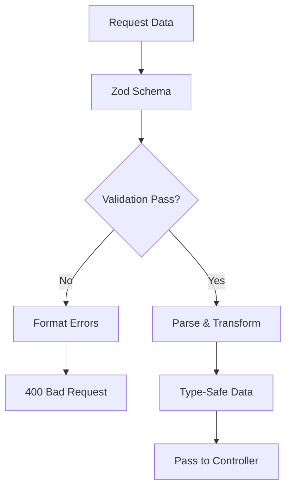

# Tài Liệu Zod Validation System

Hệ thống validation toàn diện sử dụng Zod cho nền tảng bất động sản, đảm bảo type-safety và data integrity.

## 📋 Mục Lục

- [Tổng Quan](#tổng-quan)
- [Zod Basics](#zod-basics)
- [Common Schemas](#common-schemas)
- [Entity Validations](#entity-validations)
- [Middleware Integration](#middleware-integration)
- [Custom Validators](#custom-validators)
- [Error Handling](#error-handling)
- [Best Practices](#best-practices)
- [Testing Validations](#testing-validations)

## 🔍 Tổng Quan

### Tại Sao Sử Dụng Zod?

Zod là thư viện validation TypeScript-first mang lại nhiều lợi ích:

- **Type Safety**: Tự động infer types từ schemas
- **Runtime Validation**: Kiểm tra dữ liệu tại runtime
- **Rich Error Messages**: Error messages chi tiết và có thể custom
- **Parsing & Transform**: Tự động parse và transform dữ liệu
- **Composition**: Compose và reuse schemas dễ dàng

### Kiến Trúc Validation

```
Request → Middleware → Zod Schema → Validation → Controller
                          ↓
                    Transform Data
                          ↓
                   Type-Safe Object
```

### Flow Validation



## 🎯 Zod Basics

### Basic Types

```typescript
import { z } from "zod";

// Primitive types
const stringSchema = z.string();
const numberSchema = z.number();
const booleanSchema = z.boolean();
const dateSchema = z.date();

// With validation
const emailSchema = z.string().email("Email không hợp lệ");
const positiveNumberSchema = z.number().positive("Số phải dương");
const minLengthSchema = z.string().min(5, "Ít nhất 5 ký tự");
```

### Complex Types

```typescript
// Objects
const userSchema = z.object({
  name: z.string(),
  age: z.number().min(0),
  email: z.string().email()
});

// Arrays
const tagsSchema = z.array(z.string());
const numbersSchema = z.array(z.number()).min(1, "Ít nhất 1 phần tử");

// Enums
const statusSchema = z.enum(["active", "inactive", "pending"]);

// Unions
const idSchema = z.union([z.string(), z.number()]);
```

### Optional & Default Values

```typescript
const userSchema = z.object({
  name: z.string(),
  age: z.number().optional(),
  role: z.string().default("user"),
  isActive: z.boolean().optional().default(true)
});

// Transform
const pageSchema = z.string()
  .transform((val) => parseInt(val))
  .refine((val) => val > 0, "Page phải lớn hơn 0");
```

## 🧩 Common Schemas

### Base Validation Patterns

```typescript
// validations/common.ts
import { z } from "zod";

// Email validation with Vietnamese message
export const emailSchema = z
  .string()
  .email("Email không hợp lệ")
  .max(255, "Email quá dài");

// Password with strength requirements
export const passwordSchema = z
  .string()
  .min(6, "Mật khẩu phải có ít nhất 6 ký tự")
  .max(100, "Mật khẩu quá dài")
  .regex(
    /^(?=.*[a-z])(?=.*[A-Z])(?=.*\d)/,
    "Mật khẩu phải có chữ hoa, chữ thường và số"
  );

// Vietnamese phone number
export const phoneSchema = z
  .string()
  .optional()
  .refine((val) => {
    if (!val) return true;
    
    const cleanPhone = val.replace(/[\s\-\(\)]/g, '');
    
    // Vietnamese patterns
    const patterns = [
      /^(0|\+84)[3-9][0-9]{8}$/,     // Mobile: 03x, 05x, 07x, 08x, 09x
      /^(84)[3-9][0-9]{8}$/,         // Without +
      /^(0|\+84)[2][0-9]{8,9}$/,     // Landline: 02x
      /^(84)[2][0-9]{8,9}$/,         // Without +
    ];
    
    return patterns.some(pattern => pattern.test(cleanPhone));
  }, "Số điện thoại không đúng định dạng Việt Nam");

// Vietnamese name with accents
export const vietnameseNameSchema = z
  .string()
  .min(2, "Tên phải có ít nhất 2 ký tự")
  .max(100, "Tên quá dài")
  .regex(
    /^[a-zA-ZÀÁÂÃÈÉÊÌÍÒÓÔÕÙÚĂĐĨŨƠàáâãèéêìíòóôõùúăđĩũơƯĂẠẢẤẦẨẪẬẮẰẲẴẶẸẺẼỀỀỂưăạảấầẩẫậắằẳẵặẹẻẽềềểỄỆỈỊỌỎỐỒỔỖỘỚỜỞỠỢỤỦỨỪễệỉịọỏốồổỗộớờởỡợụủứừỬỮỰỲỴÝỶỸửữựỳỵýỷỹ\s]+$/,
    "Tên chỉ được chứa chữ cái và khoảng trắng"
  )
  .trim();

// MongoDB ObjectId
export const mongoIdSchema = z
  .string()
  .regex(/^[0-9a-fA-F]{24}$/, "ID không hợp lệ");

// Price validation
export const priceSchema = z
  .number()
  .min(0, "Giá phải lớn hơn hoặc bằng 0")
  .max(999999999999, "Giá quá lớn");

// Area validation
export const areaSchema = z
  .number()
  .min(0, "Diện tích phải lớn hơn 0")
  .max(10000, "Diện tích quá lớn");
```

### Pagination & Sorting

```typescript
// Pagination schema
export const paginationSchema = z.object({
  page: z
    .string()
    .optional()
    .transform((val) => (val ? parseInt(val) : 1))
    .refine((val) => val > 0, "Page phải lớn hơn 0"),
  limit: z
    .string()
    .optional()
    .transform((val) => (val ? parseInt(val) : 10))
    .refine((val) => val > 0 && val <= 100, "Limit phải từ 1-100"),
});

// Sort schema
export const sortSchema = z.object({
  sortBy: z.string().optional().default("createdAt"),
  sortOrder: z.enum(["asc", "desc"]).optional().default("desc"),
});

// Combined query schema
export const baseQuerySchema = z.object({
  ...paginationSchema.shape,
  ...sortSchema.shape,
  keyword: z.string().optional(),
  status: z.enum(["active", "inactive", "pending"]).optional(),
});
```

### Date & Time

```typescript
// Date schemas
export const dateSchema = z
  .string()
  .datetime("Ngày tháng không hợp lệ")
  .or(z.date());

// Date range validation
export const dateRangeSchema = z
  .object({
    startDate: z.string().datetime().optional(),
    endDate: z.string().datetime().optional(),
  })
  .refine(
    (data) =>
      !data.startDate ||
      !data.endDate ||
      new Date(data.startDate) <= new Date(data.endDate),
    {
      message: "Ngày bắt đầu phải trước ngày kết thúc",
      path: ["endDate"]
    }
  );

// Vietnamese date format
export const vietnameseDateSchema = z
  .string()
  .regex(
    /^(\d{1,2})\/(\d{1,2})\/(\d{4})$/,
    "Định dạng ngày không hợp lệ (DD/MM/YYYY)"
  )
  .transform((val) => {
    const [day, month, year] = val.split("/");
    return new Date(`${year}-${month}-${day}`);
  })
  .refine((date) => !isNaN(date.getTime()), "Ngày không hợp lệ");
```

## 🏗 Entity Validations

### Authentication Schemas

```typescript
// validations/authValidation.ts
import { emailSchema, passwordSchema, vietnameseNameSchema } from "./common";

// Register validation
export const registerSchema = z.object({
  email: emailSchema,
  password: passwordSchema,
  role: z.enum(["user", "admin", "employee"]).optional().default("user"),
});

// Login validation
export const loginSchema = z.object({
  email: emailSchema,
  password: z.string().min(1, "Mật khẩu không được để trống"),
});

// Change password with confirmation
export const changePasswordSchema = z
  .object({
    currentPassword: z.string().min(1, "Mật khẩu hiện tại không được để trống"),
    newPassword: passwordSchema,
    confirmPassword: z.string(),
  })
  .refine((data) => data.newPassword === data.confirmPassword, {
    message: "Mật khẩu xác nhận không khớp",
    path: ["confirmPassword"], // Error will be attached to confirmPassword field
  });

// Reset password
export const resetPasswordSchema = z
  .object({
    token: z.string().min(1, "Token không được để trống"),
    newPassword: passwordSchema,
    confirmPassword: z.string(),
  })
  .refine((data) => data.newPassword === data.confirmPassword, {
    message: "Mật khẩu xác nhận không khớp",
    path: ["confirmPassword"],
  });

// Profile update
export const updateProfileSchema = z.object({
  username: vietnameseNameSchema.optional(),
  phoneNumber: phoneSchema,
  avatar: z.string().url("URL avatar không hợp lệ").optional(),
  bio: z.string().max(500, "Tiểu sử quá dài").optional(),
  dateOfBirth: z.string().datetime().optional(),
  website: z.string().url("Website không hợp lệ").optional(),
});

// Type exports
export type RegisterInput = z.infer<typeof registerSchema>;
export type LoginInput = z.infer<typeof loginSchema>;
export type ChangePasswordInput = z.infer<typeof changePasswordSchema>;
```

### Post/Property Schemas

```typescript
// validations/postValidation.ts
import { mongoIdSchema, priceSchema, areaSchema } from "./common";

// Direction enum for house/balcony
const directionEnum = z.enum([
  "", "Đông", "Tây", "Nam", "Bắc",
  "Đông Nam", "Tây Nam", "Đông Bắc", "Tây Bắc"
], {
  errorMap: () => ({ message: "Hướng không hợp lệ" }),
});

// Location schema
const locationSchema = z.object({
  province: z.string().min(1, "Tỉnh/thành phố là bắt buộc").trim(),
  ward: z.string().min(1, "Phường/xã là bắt buộc").trim(),
  street: z.string().trim().optional(),
}, {
  errorMap: () => ({ message: "Thông tin địa chỉ không hợp lệ" }),
});

// Create post schema
export const createPostSchema = z.object({
  type: z.enum(["ban", "cho-thue"], {
    errorMap: () => ({
      message: 'Loại tin đăng phải là "ban" hoặc "cho-thue"',
    }),
  }),
  title: z
    .string()
    .min(30, "Tiêu đề phải có ít nhất 30 ký tự")
    .max(150, "Tiêu đề không được quá 150 ký tự")
    .trim(),
  description: z
    .string()
    .min(30, "Mô tả phải có ít nhất 30 ký tự")
    .max(500, "Mô tả không được quá 500 ký tự")
    .trim(),
  price: priceSchema.optional(),
  location: locationSchema,
  category: mongoIdSchema,
  images: z
    .array(z.string().url("URL hình ảnh không hợp lệ"))
    .min(1, "Phải có ít nhất 1 hình ảnh")
    .max(20, "Không được quá 20 hình ảnh"),
  area: areaSchema.optional(),
  
  // Property details
  legalDocs: z.string().trim().optional(),
  furniture: z.string().trim().optional(),
  bedrooms: z.number().min(0, "Số phòng ngủ phải lớn hơn hoặc bằng 0").optional(),
  bathrooms: z.number().min(0, "Số phòng tắm phải lớn hơn hoặc bằng 0").optional(),
  floors: z.number().min(0, "Số tầng phải lớn hơn hoặc bằng 0").optional(),
  houseDirection: directionEnum.optional(),
  balconyDirection: directionEnum.optional(),
  roadWidth: z.string().trim().optional(),
  frontWidth: z.string().trim().optional(),
  
  // Package info
  packageId: z.string().trim().optional(),
  packageDuration: z.number().min(0, "Thời hạn gói phải lớn hơn hoặc bằng 0").optional(),
  project: mongoIdSchema.optional(),
});

// Search schema with flexible filters
export const postSearchSchema = z.object({
  type: z.enum(["ban", "cho-thue"]).optional(),
  category: mongoIdSchema.optional(),
  province: z.string().trim().optional(),
  ward: z.string().trim().optional(),
  
  // Price range
  minPrice: z.number().min(0).optional(),
  maxPrice: z.number().min(0).optional(),
  
  // Area range
  minArea: z.number().min(0).optional(),
  maxArea: z.number().min(0).optional(),
  
  // Property features
  bedrooms: z.number().min(0).optional(),
  bathrooms: z.number().min(0).optional(),
  
  // Status filters
  status: z.enum(["pending", "active", "rejected", "expired", "inactive", "deleted"]).optional(),
  priority: z.enum(["normal", "premium", "vip"]).optional(),
  package: z.enum(["free", "basic", "premium", "vip"]).optional(),
  
  // Relationships
  author: mongoIdSchema.optional(),
  project: mongoIdSchema.optional(),
  
  // Search
  keyword: z.string().trim().optional(),
  
  // Pagination & sorting
  page: z.number().min(1).default(1),
  limit: z.number().min(1).max(100).default(10),
  sortBy: z.enum(["createdAt", "updatedAt", "price", "area", "views"]).default("createdAt"),
  sortOrder: z.enum(["asc", "desc"]).default("desc"),
});

// Status update (admin only)
export const updatePostStatusSchema = z
  .object({
    id: mongoIdSchema,
    status: z.enum(["pending", "active", "rejected", "expired", "inactive", "deleted"]),
    rejectedReason: z.string().trim().optional(),
  })
  .refine(
    (data) => {
      // If status is rejected, reason is required
      if (data.status === "rejected" && !data.rejectedReason) {
        return false;
      }
      return true;
    },
    {
      message: "Lý do từ chối là bắt buộc khi từ chối tin đăng",
      path: ["rejectedReason"],
    }
  );

// Bulk operations
export const bulkPostStatusSchema = z.object({
  postIds: z.array(mongoIdSchema).min(1, "Phải chọn ít nhất 1 tin đăng"),
  status: z.enum(["active", "rejected", "deleted"]),
  rejectedReason: z.string().trim().optional(),
});
```

### User Management Schemas

```typescript
// validations/userValidation.ts
import { emailSchema, phoneSchema, vietnameseNameSchema, mongoIdSchema } from "./common";

// User profile update
export const updateUserProfileSchema = z.object({
  fullName: vietnameseNameSchema.optional(),
  phone: phoneSchema,
  avatar: z.string().url("URL avatar không hợp lệ").optional(),
  dateOfBirth: z.string().datetime("Ngày sinh không hợp lệ").optional(),
  gender: z.enum(["male", "female", "other"]).optional(),
  address: z.string().max(255, "Địa chỉ quá dài").optional(),
  bio: z.string().max(500, "Tiểu sử quá dài").optional(),
  website: z.string().url("Website không hợp lệ").optional(),
  
  // Social media links
  socialMedia: z.object({
    facebook: z.string().url().optional(),
    zalo: z.string().optional(),
    telegram: z.string().optional(),
  }).optional(),
});

// Admin user management
export const adminUpdateUserSchema = z.object({
  username: z
    .string()
    .min(3, "Tên người dùng phải có ít nhất 3 ký tự")
    .max(50, "Tên người dùng quá dài")
    .regex(
      /^[a-zA-Z0-9_-]+$/,
      "Tên người dùng chỉ được chứa chữ cái, số, dấu gạch dưới và dấu gạch ngang"
    )
    .optional(),
  email: emailSchema.optional(),
  phoneNumber: phoneSchema,
  role: z.enum(["user", "admin", "employee"]).optional(),
  status: z.enum(["active", "banned"]).optional(),
  permissions: z.array(z.string()).optional(),
});

// User ban with reason
export const banUserSchema = z.object({
  reason: z
    .string()
    .min(10, "Lý do cấm phải có ít nhất 10 ký tự")
    .max(500, "Lý do quá dài"),
  duration: z.number().int().min(1).max(365).optional(), // days
  permanent: z.boolean().optional().default(false),
});

// Bulk user operations
export const bulkUserActionSchema = z
  .object({
    userIds: z.array(mongoIdSchema).min(1, "Phải chọn ít nhất 1 người dùng"),
    action: z.enum(["activate", "ban", "unban", "delete", "verify_email"]),
    reason: z.string().optional(),
  })
  .refine((data) => data.action !== "ban" || data.reason, {
    message: "Phải cung cấp lý do khi cấm người dùng",
    path: ["reason"],
  });

// Notification preferences
export const notificationPreferencesSchema = z.object({
  email: z.object({
    newProperty: z.boolean().default(true),
    priceAlert: z.boolean().default(true),
    newsletter: z.boolean().default(false),
    systemUpdates: z.boolean().default(true),
  }).optional(),
  
  push: z.object({
    newProperty: z.boolean().default(true),
    priceAlert: z.boolean().default(true),
    messages: z.boolean().default(true),
  }).optional(),
  
  sms: z.object({
    important: z.boolean().default(false),
    priceAlert: z.boolean().default(false),
  }).optional(),
});
```

## 🔧 Middleware Integration

### Validation Middleware

```typescript
// middleware/validation.ts
import { z } from "zod";
import { Request, Response, NextFunction } from "express";

// Generic validation middleware
export const validate = (
  schema: z.ZodSchema,
  property: "body" | "query" | "params" = "body"
) => {
  return (req: Request, res: Response, next: NextFunction) => {
    try {
      const dataToValidate = req[property];
      const validatedData = schema.parse(dataToValidate);

      // Replace original data with validated & transformed data
      req[property] = validatedData;
      next();
    } catch (error) {
      if (error instanceof z.ZodError) {
        // Create user-friendly message for toast
        const firstError = error.errors[0];
        const toastMessage = firstError ? firstError.message : "Dữ liệu không hợp lệ";
        
        return res.status(400).json({
          success: false,
          message: toastMessage, // Main message for toast display
          errors: error.errors.map((e) => ({
            field: e.path.join("."),
            message: e.message,
            code: e.code,
            received: e.received,
          })),
        });
      }
      next(error);
    }
  };
};

// Specific middleware functions
export const validateBody = (schema: z.ZodSchema) => validate(schema, "body");
export const validateQuery = (schema: z.ZodSchema) => validate(schema, "query");
export const validateParams = (schema: z.ZodSchema) => validate(schema, "params");

// Multiple validation
export const validateMultiple = (schemas: {
  body?: z.ZodSchema;
  query?: z.ZodSchema;
  params?: z.ZodSchema;
}) => {
  return (req: Request, res: Response, next: NextFunction) => {
    try {
      const errors: any[] = [];

      // Validate each specified property
      Object.entries(schemas).forEach(([location, schema]) => {
        if (schema) {
          try {
            const dataToValidate = req[location as keyof Request];
            const validatedData = schema.parse(dataToValidate);
            (req as any)[location] = validatedData;
          } catch (error) {
            if (error instanceof z.ZodError) {
              errors.push(...error.errors.map((e) => ({
                location,
                field: e.path.join("."),
                message: e.message,
                code: e.code,
                received: e.received,
              })));
            }
          }
        }
      });

      if (errors.length > 0) {
        const firstError = errors[0];
        const toastMessage = firstError ? firstError.message : "Dữ liệu không hợp lệ";
        
        return res.status(400).json({
          success: false,
          message: toastMessage,
          errors,
        });
      }

      next();
    } catch (error) {
      next(error);
    }
  };
};
```

### Usage in Routes

```typescript
// routes/postRoutes.ts
import { validateBody, validateQuery, validateParams } from "../middleware/validation";
import { createPostSchema, postSearchSchema, updatePostStatusSchema } from "../validations/postValidation";
import { mongoIdSchema } from "../validations/common";

const router = express.Router();

// Create post with body validation
router.post("/",
  requireAuth,
  validateBody(createPostSchema),
  PostController.create
);

// Search posts with query validation
router.get("/search",
  validateQuery(postSearchSchema),
  PostController.search
);

// Update post status with multiple validations
router.put("/:id/status",
  requireAdmin,
  validateParams(z.object({ id: mongoIdSchema })),
  validateBody(updatePostStatusSchema.omit({ id: true })), // Exclude id from body
  PostController.updateStatus
);

// Get post by ID with param validation
router.get("/:id",
  validateParams(z.object({ id: mongoIdSchema })),
  PostController.getById
);
```

### Advanced Validation Patterns

```typescript
// Conditional validation based on request context
export const validatePostUpdate = (req: Request, res: Response, next: NextFunction) => {
  const isAdmin = req.user?.role === "admin";
  
  // Different schemas for admin vs regular user
  const schema = isAdmin 
    ? adminUpdatePostSchema  // Can change status, featured, etc.
    : userUpdatePostSchema;  // Limited fields
  
  return validateBody(schema)(req, res, next);
};

// Dynamic schema based on post type
export const validatePostCreation = (req: Request, res: Response, next: NextFunction) => {
  const postType = req.body.type;
  
  let schema = createPostSchema;
  
  if (postType === "ban") {
    // For sale posts, price is required
    schema = schema.extend({
      price: z.number().positive("Giá bán là bắt buộc cho tin rao bán")
    });
  } else if (postType === "cho-thue") {
    // For rental posts, additional rental fields
    schema = schema.extend({
      price: z.number().positive("Giá thuê là bắt buộc cho tin cho thuê"),
      deposit: z.number().min(0, "Tiền cọc phải lớn hơn hoặc bằng 0").optional()
    });
  }
  
  return validateBody(schema)(req, res, next);
};
```

## 🎨 Custom Validators

### Advanced Custom Validators

```typescript
// Custom phone validator for Vietnam
export const vietnamesePhoneValidator = z.string()
  .transform((val) => val.replace(/[\s\-\(\)]/g, '')) // Clean format
  .refine((val) => {
    const patterns = [
      /^(0|\+84)[3-9][0-9]{8}$/,     // Mobile
      /^(84)[3-9][0-9]{8}$/,         // Mobile without +
      /^(0|\+84)[2][0-9]{8,9}$/,     // Landline
    ];
    return patterns.some(pattern => pattern.test(val));
  }, "Số điện thoại không đúng định dạng")
  .transform((val) => {
    // Normalize format
    if (val.startsWith('84')) return '+' + val;
    if (val.startsWith('0')) return '+84' + val.slice(1);
    return val;
  });

// Vietnamese ID number validator
export const vietnameseIdValidator = z.string()
  .length(12, "CCCD phải có 12 số")
  .regex(/^[0-9]{12}$/, "CCCD chỉ được chứa số")
  .refine((val) => {
    // Basic checksum validation for Vietnamese ID
    const weights = [2, 3, 4, 5, 6, 7, 8, 9, 10, 11];
    const digits = val.slice(0, 10).split('').map(Number);
    const checksum = digits.reduce((sum, digit, index) => sum + digit * weights[index], 0);
    const checkDigits = parseInt(val.slice(10));
    return (checksum % 11) === (checkDigits % 11);
  }, "Số CCCD không hợp lệ");

// Price range validator
export const priceRangeValidator = z.object({
  min: z.number().min(0).optional(),
  max: z.number().min(0).optional()
}).refine((data) => {
  if (data.min && data.max) {
    return data.min <= data.max;
  }
  return true;
}, {
  message: "Giá tối thiểu phải nhỏ hơn hoặc bằng giá tối đa",
  path: ["max"]
});

// File upload validator
export const imageUploadValidator = z.object({
  mimetype: z.string().refine(
    (type) => type.startsWith('image/'),
    "File phải là hình ảnh"
  ),
  size: z.number().max(10 * 1024 * 1024, "File không được quá 10MB"),
  filename: z.string().refine(
    (name) => /\.(jpg|jpeg|png|webp)$/i.test(name),
    "File phải có định dạng jpg, jpeg, png hoặc webp"
  )
});

// Location validator with external API check
export const locationValidator = z.object({
  province: z.string(),
  ward: z.string(),
  street: z.string().optional()
}).superRefine(async (data, ctx) => {
  // Check if province and ward combination is valid
  try {
    const isValid = await validateLocationExists(data.province, data.ward);
    if (!isValid) {
      ctx.addIssue({
        code: z.ZodIssueCode.custom,
        message: "Tỉnh/thành phố và phường/xã không hợp lệ",
        path: ["ward"]
      });
    }
  } catch (error) {
    ctx.addIssue({
      code: z.ZodIssueCode.custom,
      message: "Không thể xác thực địa chỉ",
      path: ["ward"]
    });
  }
});

// Async validation helper
const validateLocationExists = async (province: string, ward: string): Promise<boolean> => {
  // Mock API call to location service
  const response = await fetch(`/api/locations/validate?province=${province}&ward=${ward}`);
  return response.ok;
};
```

### Business Logic Validators

```typescript
// Property availability validator
export const propertyAvailabilityValidator = z.object({
  postId: mongoIdSchema,
  checkInDate: z.string().datetime(),
  checkOutDate: z.string().datetime()
}).superRefine(async (data, ctx) => {
  // Check if property is available for the date range
  const isAvailable = await checkPropertyAvailability(
    data.postId,
    data.checkInDate,
    data.checkOutDate
  );
  
  if (!isAvailable) {
    ctx.addIssue({
      code: z.ZodIssueCode.custom,
      message: "Bất động sản không có sẵn trong khoảng thời gian này",
      path: ["checkInDate"]
    });
  }
});

// User permission validator
export const userActionValidator = (requiredPermission: string) => {
  return z.object({
    userId: mongoIdSchema,
    action: z.string()
  }).superRefine(async (data, ctx) => {
    const user = await getUserById(data.userId);
    if (!user || !user.permissions.includes(requiredPermission)) {
      ctx.addIssue({
        code: z.ZodIssueCode.custom,
        message: "Không có quyền thực hiện hành động này",
        path: ["action"]
      });
    }
  });
};

// Unique field validator
export const uniqueFieldValidator = (model: any, field: string, currentId?: string) => {
  return z.string().superRefine(async (value, ctx) => {
    const query: any = { [field]: value };
    if (currentId) {
      query._id = { $ne: currentId }; // Exclude current record for updates
    }
    
    const existing = await model.findOne(query);
    if (existing) {
      ctx.addIssue({
        code: z.ZodIssueCode.custom,
        message: `${field} đã tồn tại`,
        path: []
      });
    }
  });
};

// Usage
const userEmailSchema = z.object({
  email: emailSchema.superRefine(async (email, ctx) => {
    const existing = await User.findOne({ email });
    if (existing) {
      ctx.addIssue({
        code: z.ZodIssueCode.custom,
        message: "Email đã được sử dụng",
        path: []
      });
    }
  })
});
```

## ❌ Error Handling

### Error Types & Codes

```typescript
// types/validation.ts
export interface ValidationError {
  field: string;
  message: string;
  code: string;
  received?: any;
}

export interface ValidationResponse {
  success: false;
  message: string;
  errors: ValidationError[];
}

// Error code mapping
export const ZodErrorCodes = {
  required_error: "Trường này là bắt buộc",
  invalid_type: "Kiểu dữ liệu không hợp lệ",
  invalid_email: "Email không đúng định dạng",
  too_small: "Giá trị quá nhỏ",
  too_big: "Giá trị quá lớn",
  invalid_string: "Chuỗi không hợp lệ",
  custom: "Lỗi tùy chỉnh"
};
```

### Custom Error Formatting

```typescript
// utils/formatValidationErrors.ts
export const formatValidationErrors = (zodError: z.ZodError): ValidationResponse => {
  const errors: ValidationError[] = zodError.errors.map((error) => {
    const field = error.path.join(".");
    let message = error.message;
    
    // Custom message based on error code
    switch (error.code) {
      case "invalid_type":
        if (error.expected === "string" && error.received === "number") {
          message = `${field} phải là chuỗi ký tự, nhận được số`;
        }
        break;
      case "too_small":
        if (error.type === "string") {
          message = `${field} phải có ít nhất ${error.minimum} ký tự`;
        } else if (error.type === "number") {
          message = `${field} phải lớn hơn hoặc bằng ${error.minimum}`;
        }
        break;
      case "too_big":
        if (error.type === "string") {
          message = `${field} không được quá ${error.maximum} ký tự`;
        } else if (error.type === "number") {
          message = `${field} phải nhỏ hơn hoặc bằng ${error.maximum}`;
        }
        break;
    }
    
    return {
      field,
      message,
      code: error.code,
      received: error.received
    };
  });
  
  // Get main message for toast display
  const mainMessage = errors[0]?.message || "Dữ liệu không hợp lệ";
  
  return {
    success: false,
    message: mainMessage,
    errors
  };
};

// Enhanced validation middleware with custom formatting
export const validateWithCustomErrors = (schema: z.ZodSchema, property: "body" | "query" | "params" = "body") => {
  return (req: Request, res: Response, next: NextFunction) => {
    try {
      const dataToValidate = req[property];
      const validatedData = schema.parse(dataToValidate);
      req[property] = validatedData;
      next();
    } catch (error) {
      if (error instanceof z.ZodError) {
        const formattedResponse = formatValidationErrors(error);
        return res.status(400).json(formattedResponse);
      }
      next(error);
    }
  };
};
```

### Error Context & Debugging

```typescript
// Development error debugging
export const debugValidationErrors = (error: z.ZodError, req: Request) => {
  if (process.env.NODE_ENV === 'development') {
    console.log('🔍 Validation Error Debug:', {
      path: req.path,
      method: req.method,
      body: req.body,
      query: req.query,
      params: req.params,
      errors: error.errors
    });
  }
};

// Enhanced middleware with debugging
export const validateWithDebug = (schema: z.ZodSchema, property: "body" | "query" | "params" = "body") => {
  return (req: Request, res: Response, next: NextFunction) => {
    try {
      const dataToValidate = req[property];
      const validatedData = schema.parse(dataToValidate);
      req[property] = validatedData;
      next();
    } catch (error) {
      if (error instanceof z.ZodError) {
        debugValidationErrors(error, req);
        const formattedResponse = formatValidationErrors(error);
        return res.status(400).json(formattedResponse);
      }
      next(error);
    }
  };
};
```

## 💡 Best Practices

### 1. Schema Organization

```typescript
// ✅ GOOD: Organize schemas by entity and reuse common patterns
// validations/
//   ├── common.ts         # Reusable patterns
//   ├── auth.ts          # Authentication schemas
//   ├── user.ts          # User management
//   ├── post.ts          # Property posts
//   ├── payment.ts       # Payment processing
//   └── index.ts         # Export all schemas

// common.ts - Base schemas
export const baseQuerySchema = z.object({
  page: paginationSchema.shape.page,
  limit: paginationSchema.shape.limit,
  sortBy: sortSchema.shape.sortBy,
  sortOrder: sortSchema.shape.sortOrder,
});

// auth.ts - Extend base schemas
export const loginSchema = z.object({
  email: emailSchema,
  password: passwordSchema,
});

// ❌ AVOID: Duplicate validation logic
const userLoginSchema = z.object({
  email: z.string().email(), // Duplicated email validation
  password: z.string().min(6), // Duplicated password validation
});
```

### 2. Type Safety

```typescript
// ✅ GOOD: Export types for TypeScript
export const createUserSchema = z.object({
  name: z.string(),
  email: emailSchema,
  role: z.enum(["user", "admin"])
});

export type CreateUserInput = z.infer<typeof createUserSchema>;

// Use in controllers with full type safety
export const createUser = (req: Request<{}, {}, CreateUserInput>, res: Response) => {
  const { name, email, role } = req.body; // All typed correctly
  // ...
};

// ❌ AVOID: Manual type definitions that can get out of sync
interface CreateUserInput {
  name: string;
  email: string; 
  role: "user" | "admin";
}
```

### 3. Error Messages

```typescript
// ✅ GOOD: Consistent, user-friendly Vietnamese messages
export const phoneSchema = z
  .string()
  .regex(/^[0-9+\-\s\(\)]+$/, "Số điện thoại chỉ được chứa số và ký tự đặc biệt")
  .min(10, "Số điện thoại phải có ít nhất 10 số")
  .max(15, "Số điện thoại không được quá 15 số");

// ❌ AVOID: Technical or English error messages
export const phoneSchema = z
  .string()
  .regex(/^[0-9+\-\s\(\)]+$/, "Invalid phone format")
  .min(10, "String must contain at least 10 character(s)");
```

### 4. Performance Optimization

```typescript
// ✅ GOOD: Cache complex schemas
const schemaCache = new Map<string, z.ZodSchema>();

export const getCachedSchema = (key: string, schemaFactory: () => z.ZodSchema) => {
  if (!schemaCache.has(key)) {
    schemaCache.set(key, schemaFactory());
  }
  return schemaCache.get(key)!;
};

// ❌ AVOID: Recreating complex schemas on every request
export const validatePost = (req: Request, res: Response, next: NextFunction) => {
  const schema = z.object({
    // Complex schema definition repeated every time
  });
  // ...
};
```

### 5. Async Validation

```typescript
// ✅ GOOD: Use superRefine for async validation with proper error handling
export const uniqueEmailSchema = z.string().email().superRefine(async (email, ctx) => {
  try {
    const existingUser = await User.findOne({ email });
    if (existingUser) {
      ctx.addIssue({
        code: z.ZodIssueCode.custom,
        message: "Email đã được sử dụng",
        path: []
      });
    }
  } catch (error) {
    ctx.addIssue({
      code: z.ZodIssueCode.custom,
      message: "Không thể kiểm tra tính duy nhất của email",
      path: []
    });
  }
});

// ❌ AVOID: Async validation without proper error handling
export const uniqueEmailSchema = z.string().email().superRefine(async (email, ctx) => {
  const existingUser = await User.findOne({ email }); // No error handling
  if (existingUser) {
    ctx.addIssue(/* ... */);
  }
});
```

## 🧪 Testing Validations

### Unit Testing Schemas

```typescript
// __tests__/validations/postValidation.test.ts
import { createPostSchema, postSearchSchema } from "../../src/validations/postValidation";

describe("Post Validation", () => {
  describe("createPostSchema", () => {
    const validPostData = {
      type: "ban",
      title: "Bán nhà đẹp 3 tầng tại quận 1",
      description: "Nhà đẹp, vị trí thuận lợi, giá cả hợp lý",
      price: 5000000000,
      location: {
        province: "ho-chi-minh",
        ward: "ben-nghe"
      },
      category: "507f1f77bcf86cd799439011",
      images: ["https://example.com/image1.jpg"],
      area: 120
    };

    it("should validate correct post data", () => {
      const result = createPostSchema.safeParse(validPostData);
      expect(result.success).toBe(true);
      
      if (result.success) {
        expect(result.data.type).toBe("ban");
        expect(result.data.title).toBe(validPostData.title);
      }
    });

    it("should reject post with invalid type", () => {
      const invalidData = { ...validPostData, type: "invalid" };
      const result = createPostSchema.safeParse(invalidData);
      
      expect(result.success).toBe(false);
      if (!result.success) {
        expect(result.error.errors[0].path).toEqual(["type"]);
        expect(result.error.errors[0].message).toContain("ban");
      }
    });

    it("should require minimum title length", () => {
      const invalidData = { ...validPostData, title: "Short" };
      const result = createPostSchema.safeParse(invalidData);
      
      expect(result.success).toBe(false);
      if (!result.success) {
        expect(result.error.errors[0].path).toEqual(["title"]);
        expect(result.error.errors[0].message).toContain("30 ký tự");
      }
    });

    it("should validate price range", () => {
      const invalidData = { ...validPostData, price: -1000 };
      const result = createPostSchema.safeParse(invalidData);
      
      expect(result.success).toBe(false);
      if (!result.success) {
        expect(result.error.errors[0].path).toEqual(["price"]);
      }
    });

    it("should validate image URLs", () => {
      const invalidData = { 
        ...validPostData, 
        images: ["not-a-url", "https://valid.com/image.jpg"]
      };
      const result = createPostSchema.safeParse(invalidData);
      
      expect(result.success).toBe(false);
      if (!result.success) {
        const imageErrors = result.error.errors.filter(e => e.path[0] === "images");
        expect(imageErrors.length).toBeGreaterThan(0);
      }
    });
  });

  describe("postSearchSchema", () => {
    it("should apply default values", () => {
      const result = postSearchSchema.parse({});
      expect(result.page).toBe(1);
      expect(result.limit).toBe(10);
      expect(result.sortBy).toBe("createdAt");
      expect(result.sortOrder).toBe("desc");
    });

    it("should validate price range", () => {
      const validSearch = {
        minPrice: 1000000,
        maxPrice: 5000000
      };
      const result = postSearchSchema.safeParse(validSearch);
      expect(result.success).toBe(true);
    });

    it("should reject invalid sort fields", () => {
      const invalidSearch = {
        sortBy: "invalidField"
      };
      const result = postSearchSchema.safeParse(invalidSearch);
      expect(result.success).toBe(false);
    });
  });
});
```

### Integration Testing

```typescript
// __tests__/integration/validation.test.ts
import request from "supertest";
import app from "../../src/app";

describe("Validation Integration", () => {
  describe("POST /api/posts", () => {
    it("should create post with valid data", async () => {
      const validPost = {
        type: "ban",
        title: "Test property với tiêu đề đủ dài",
        description: "Mô tả chi tiết về bất động sản này",
        price: 2000000000,
        location: {
          province: "ho-chi-minh",
          ward: "ben-nghe"
        },
        category: "507f1f77bcf86cd799439011",
        images: ["https://example.com/test.jpg"],
        area: 100
      };

      const response = await request(app)
        .post("/api/posts")
        .set("Authorization", "Bearer " + validToken)
        .send(validPost);

      expect(response.status).toBe(201);
      expect(response.body.success).toBe(true);
    });

    it("should return validation errors for invalid data", async () => {
      const invalidPost = {
        type: "invalid",
        title: "Short",
        description: "Short",
        price: -1000,
        images: ["not-a-url"]
      };

      const response = await request(app)
        .post("/api/posts")
        .set("Authorization", "Bearer " + validToken)
        .send(invalidPost);

      expect(response.status).toBe(400);
      expect(response.body.success).toBe(false);
      expect(response.body.errors).toBeDefined();
      expect(Array.isArray(response.body.errors)).toBe(true);
      
      // Check specific errors
      const errors = response.body.errors;
      expect(errors.find((e: any) => e.field === "type")).toBeDefined();
      expect(errors.find((e: any) => e.field === "title")).toBeDefined();
      expect(errors.find((e: any) => e.field === "price")).toBeDefined();
    });
  });

  describe("GET /api/posts/search", () => {
    it("should apply default query parameters", async () => {
      const response = await request(app)
        .get("/api/posts/search");

      expect(response.status).toBe(200);
      // Check that defaults were applied in the response metadata
      expect(response.body.data.pagination.page).toBe(1);
      expect(response.body.data.pagination.limit).toBe(10);
    });

    it("should validate query parameters", async () => {
      const response = await request(app)
        .get("/api/posts/search?page=-1&limit=1000&sortBy=invalid");

      expect(response.status).toBe(400);
      expect(response.body.success).toBe(false);
      expect(response.body.errors).toBeDefined();
    });
  });
});
```

### Mocking Async Validations

```typescript
// __tests__/validations/asyncValidation.test.ts
import { uniqueEmailSchema } from "../../src/validations/customValidators";
import { User } from "../../src/models/User";

// Mock the User model
jest.mock("../../src/models/User");
const mockedUser = User as jest.Mocked<typeof User>;

describe("Async Validations", () => {
  beforeEach(() => {
    jest.clearAllMocks();
  });

  describe("uniqueEmailSchema", () => {
    it("should pass for unique email", async () => {
      mockedUser.findOne.mockResolvedValue(null);

      const result = await uniqueEmailSchema.safeParseAsync("new@example.com");
      
      expect(result.success).toBe(true);
      expect(mockedUser.findOne).toHaveBeenCalledWith({ 
        email: "new@example.com" 
      });
    });

    it("should fail for existing email", async () => {
      mockedUser.findOne.mockResolvedValue({ 
        email: "existing@example.com" 
      } as any);

      const result = await uniqueEmailSchema.safeParseAsync("existing@example.com");
      
      expect(result.success).toBe(false);
      if (!result.success) {
        expect(result.error.errors[0].message).toContain("đã được sử dụng");
      }
    });

    it("should handle database errors", async () => {
      mockedUser.findOne.mockRejectedValue(new Error("DB Error"));

      const result = await uniqueEmailSchema.safeParseAsync("test@example.com");
      
      expect(result.success).toBe(false);
      if (!result.success) {
        expect(result.error.errors[0].message).toContain("kiểm tra");
      }
    });
  });
});
```

---

## 📞 Hỗ Trợ

Nếu gặp vấn đề với Zod validation system:

1. **Check Schema Definitions**: Verify schema structure and types
2. **Test Validation Logic**: Use unit tests to validate schemas
3. **Debug Error Messages**: Enable detailed error logging in development
4. **Performance Issues**: Consider caching complex schemas
5. **Async Validation**: Ensure proper error handling for database checks

**Development Tips**:
- Use `safeParse()` for testing without throwing errors
- Enable Zod debugging with detailed error paths
- Test edge cases and invalid data scenarios
- Keep error messages user-friendly and in Vietnamese
- Document complex validation logic with examples